# **Docker Setup and DVWA Deployment**

After Docker installation from https://www.docker.com/products/docker-desktop/ we verify the installation, and then deploy DVWA in Docker.

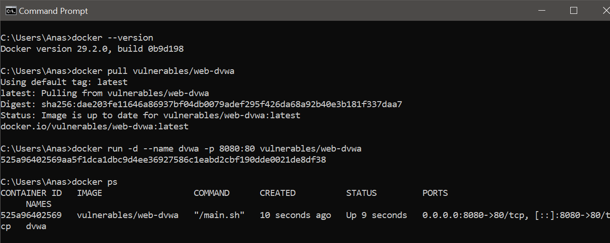

We go to [http://localhost:8080](url) and are presented with the login screen, we click on login without entering anything.

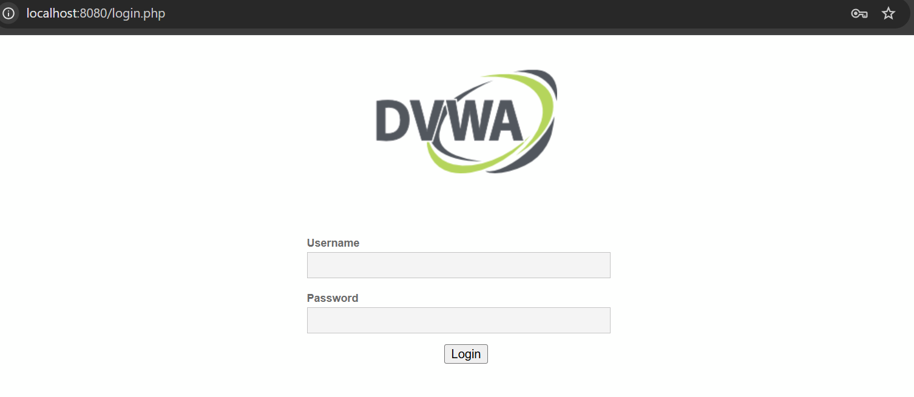

We are then led to a page where we can create/reset database for our DVWA setup.

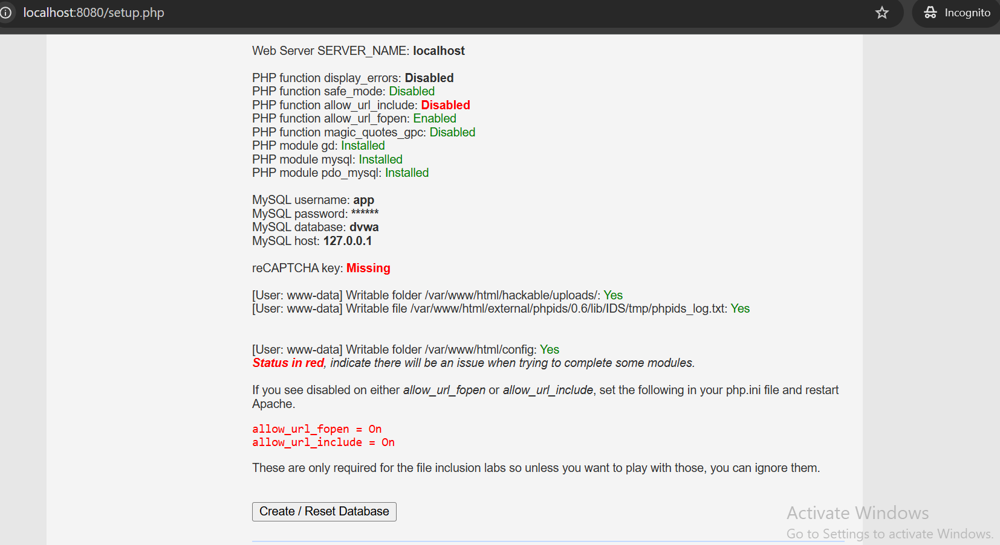

Once it is done, we see the following and are asked to login:

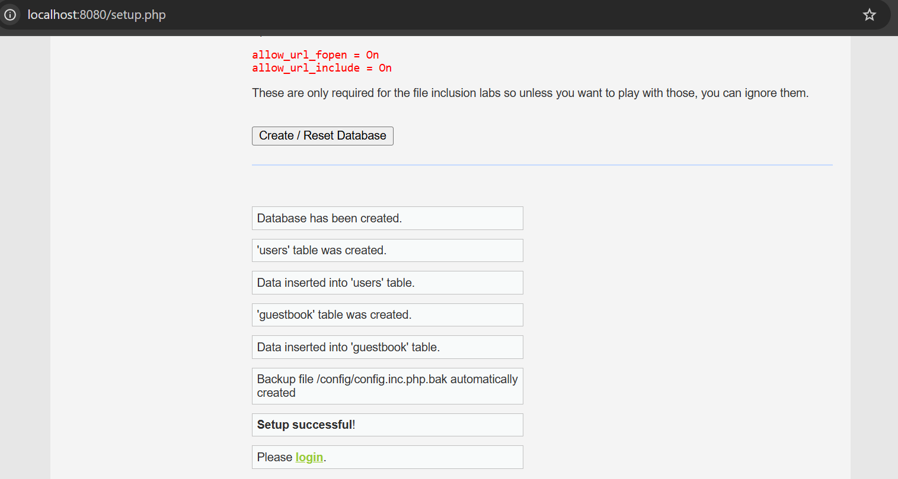

Using the credentials username: admin and password: password, we are able to login.

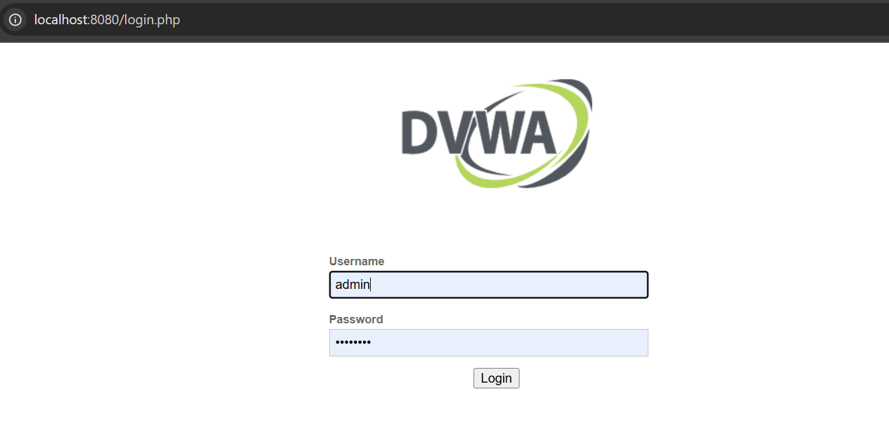

# **Vulnerability 1: Bruteforce**

1.  <ins>Security Level:</ins> Low

<ins>Payload Used:</ins> Input used (Username/Password): admin/password

<ins>Result:</ins> Login successful (failed on some prior attempts)

<ins>Screenshots:</ins>

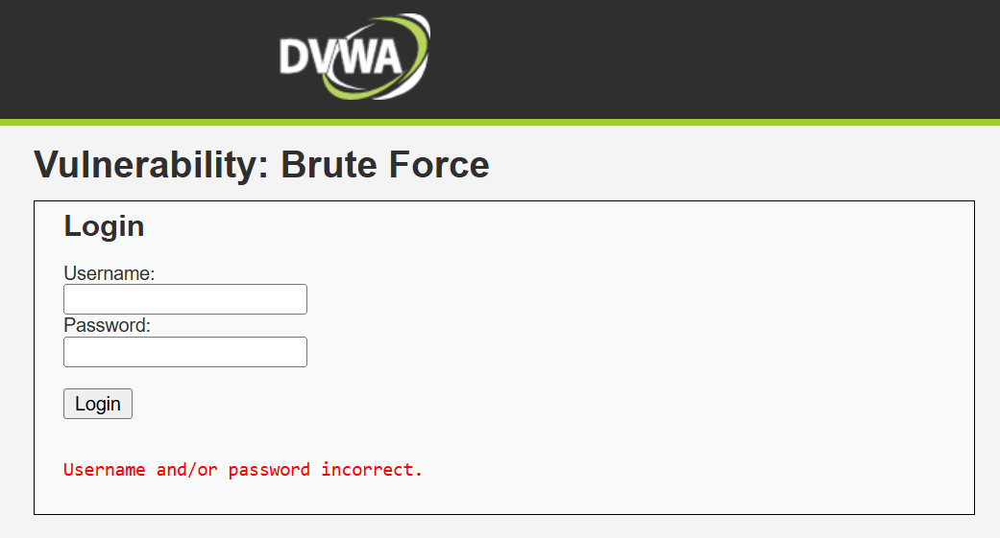

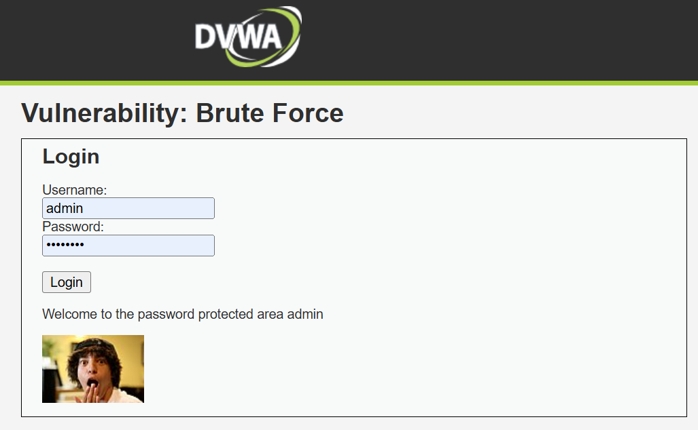

<ins>Explanation of why it worked:</ins> At the low security, DVWA does not
implement any protection against repeated login attempts. There is no
rate limit, account lockout, or other such measures. Therefore attackers
can attempt password guesses unlimited times. Also username and password
are being exposed in cleartext within the URL query string
(?username=admin&password=password) as they are sent through a GET
request by the application.

2.  <ins>Security Level:</ins> Medium

<ins>Payload Used:</ins> admin/password

<ins>Result:</ins> Login successful (failed a few prior times)

<ins>Screenshots:</ins>

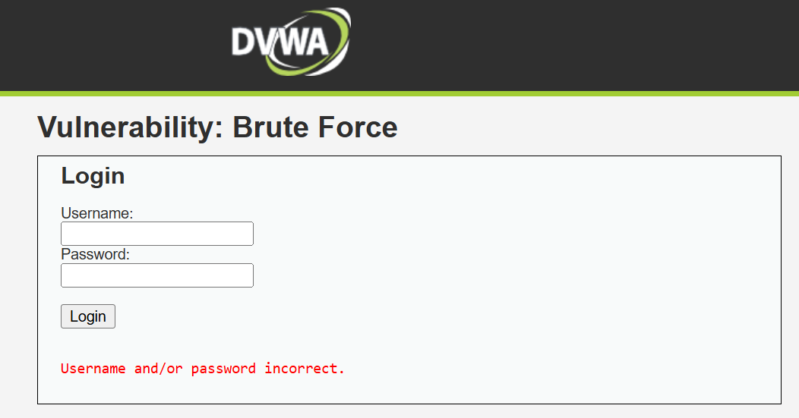

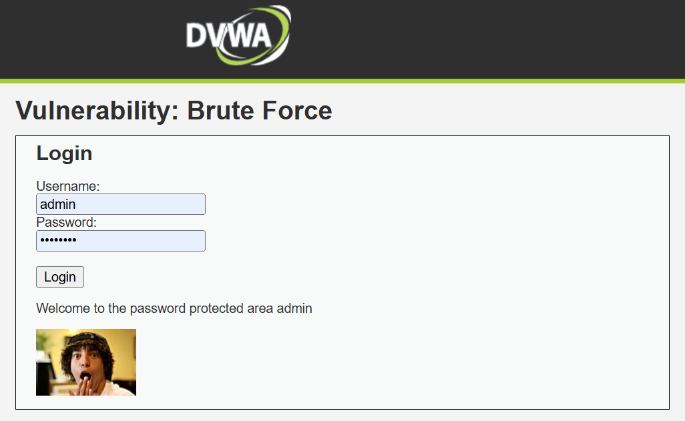

<ins>Explanation of why it worked:</ins> There were some levels of measures
taken to prevent repeated attempts such as delay in verification of
credentials. However, there were no measures taken to limit the number
of attempts for added security. Here as well, username and password are
being exposed in cleartext within the URL query string
(?username=admin&password=password). Only basic brute-force mitigation
is observed.

3.  <ins>Security Level:</ins> High

<ins>Payload Used:</ins> admin/password

<ins>Result:</ins> Login successful (failed on prior attempts)

<ins>Screenshots:</ins>

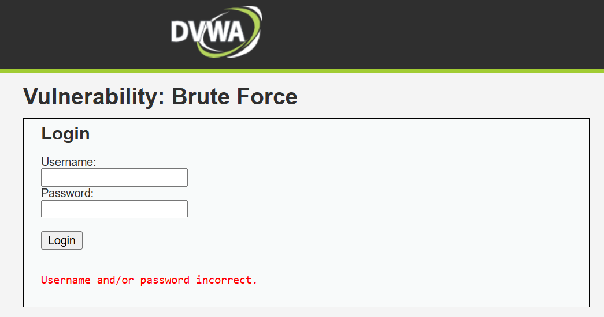

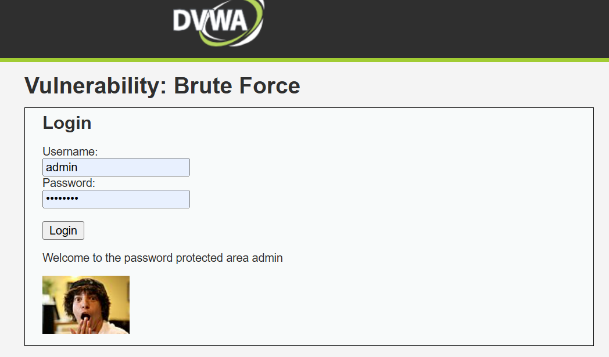

<ins>Explanation of why it worked:</ins> There were also some delays here to
prevent continuous repeated attempts but measures like rate limiting
were still not observed at this higher security level. CAPTCHA
verification, request throttling, etc. were also not there, but the
attack becomes more expensive with respect to time to execute. Username
and password are still visible in the URL after attempt.

<ins>Explanation of why it would fail at even higher level:</ins> The attack
worked on all three levels, it just took more time in the medium and
high levels due to the delay between attempts. Although this increases
the time required for brute forcing, it does not fully prevent the
attack because there is still no strict limit on the number of login
attempts.

# **Vulnerability 2: Command Injection**

1.  <ins>Security Level:</ins> Low

<ins>Payload Used:</ins> 127.0.0.1; ls

<ins>Result:</ins> After execution of the ping command, directory listing of
the server is also displayed.

<ins>Screenshots:</ins>

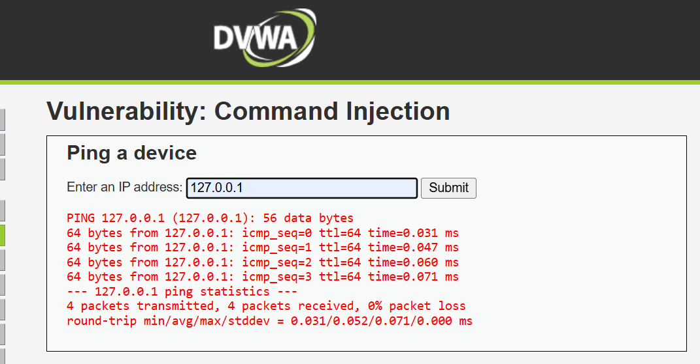

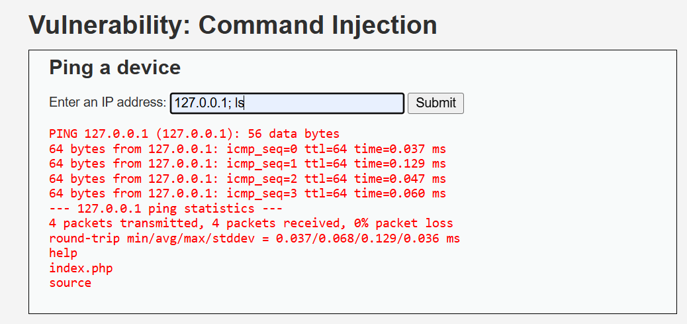

<ins>Explanation of why it worked:</ins> The application just inserts user
input into a system command without any sort of validation. This allows
attackers to append additional commands using shell separators like ';'.

2.  <ins>Security Level:</ins> Medium

<ins>Payload Used:</ins> 127.0.0.1; ls and then 127.0.0.1&& and then ls
127.0.0.1 \| ls

<ins>Result:</ins> The “;” character seems to be filtered but the pipe
operator seems to do the job by giving us the directory listing

<ins>Screenshots:</ins>

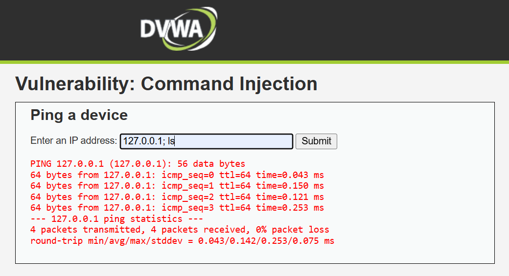

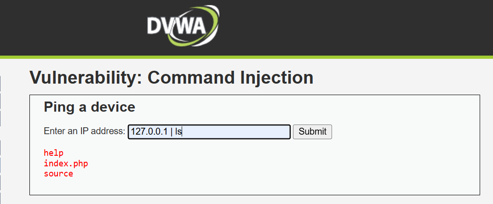

<ins>Explanation of why it worked:</ins> Only some special characters are
filtered at this security level, the input still isn’t fully validated
resulting in possibilities to still bypass the filtering.

3.  <ins>Security Level:</ins> High

<ins>Payload Used:</ins> 127.0.0.1; ls and then 127.0.0.1&& and then ls
127.0.0.1 \| ls then finally 127.0.0.1|dir

<ins>Result:</ins>

Command injection succeeded.

<ins>Screenshots:</ins>

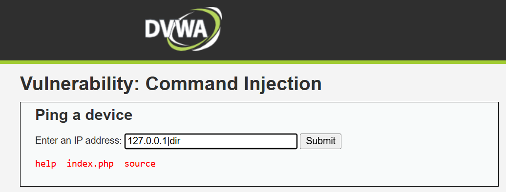

<ins>Explanation of why it worked:</ins> There might have been stricter validation of input here, but since the pipe operator was still not filtered, it enabled us to carry out our desired operation. Therefore, there is still a need of stricter checks at this level.

# **Vulnerability 3: CSRF**

1.  <ins>Security Level:</ins> Low

<ins>Payload Used:</ins>
http://localhost:8080/vulnerabilities/csrf/?password_new=test123&password_conf=test123&Change=Change

<ins>Result:</ins> Password change successful

<ins>Screenshots:</ins>

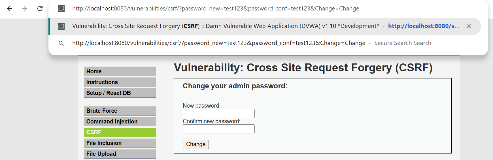

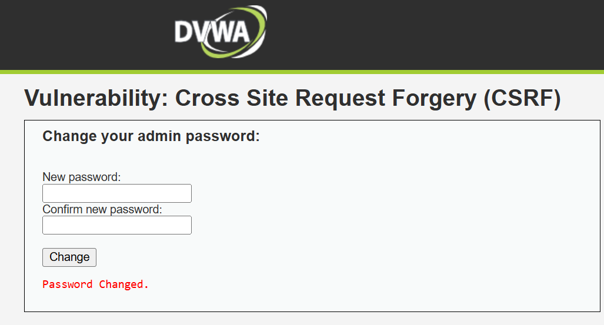

<ins>Explanation of Why it Worked:</ins> At the lowest security, DVWA does
not implement any CSRF token validation. The server accepts requests
without verifying their origin at all.

2.  <ins>Security Level:</ins> Medium

<ins>Payload Used:
<http://localhost:8080/vulnerabilities/csrf/?password_new=test123&password_conf=test123&Change=Change></ins>
and then

```html
<html>
<body onload="document.forms[0].submit()">
<form action="http://localhost:8080/vulnerabilities/csrf/" method="GET">
<input type="hidden" name="password_new" value="hacked">
<input type="hidden" name="password_conf" value="hacked">
<input type="hidden" name="Change" value="Change">
</form>
</body>
</html>
</script>
```
in a new HTML file.

<ins>Result:</ins> Password change failed when file was run without live server, but succeeded when live server extension on VS Code was used.

<ins>Screenshots:</ins>

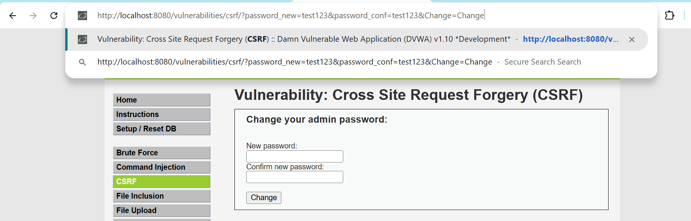

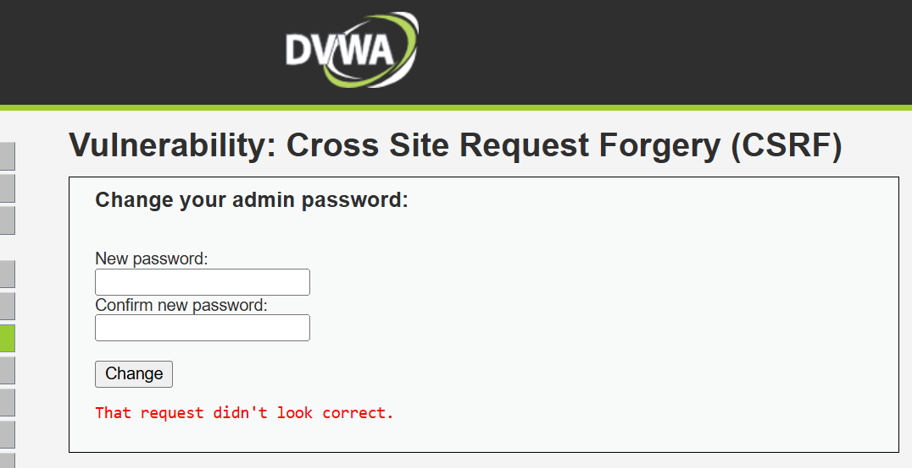

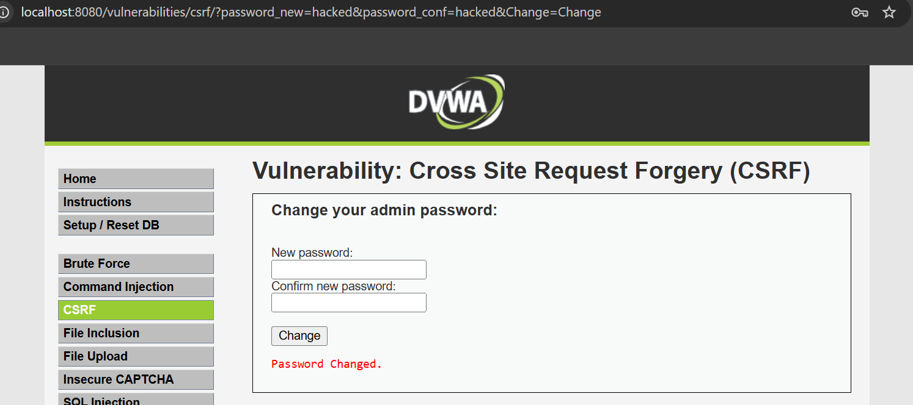

<ins>Explanation of Why It Worked:</ins> DVWA at this security level adds simple defense such as checking referer header. By using live server, the protocol changed from file:// to http:// and the request was executed normally. The DVWA session was recognized and cookies are sent with the request.

3.  <ins>Security Level:</ins> High

<ins>Payload Used:
http://localhost:8080/vulnerabilities/csrf/?password_new=password1&password_conf=password1&Change=Change&user_token=a831b05a2632d1efbfa432494aa58a01</ins>

<ins>Result:</ins> Password change successful.

<ins>Screenshots:</ins>

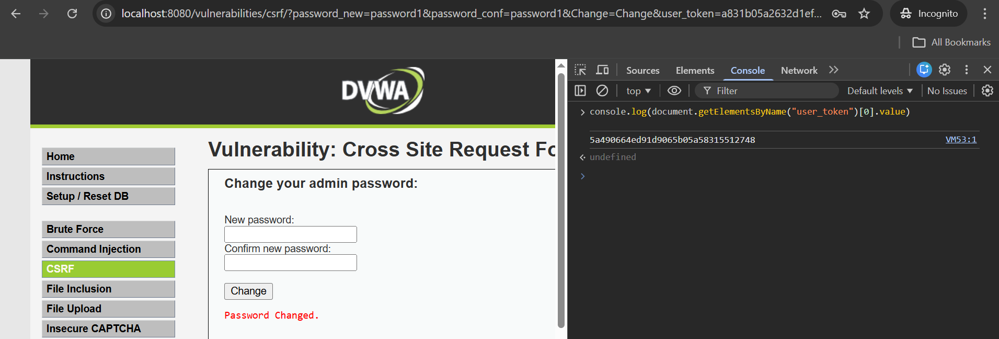

<ins>Explanation of Why It Worked:</ins> At the high security level, DVWA uses anti-CSRF tokens for added protection. These tokens are a need in requests to validate authenticity. To bypass, we can inspect the page source or use the browser console to get the token and then it can be put into the payload to make it seem like a verified request.

# **Vulnerability 4: File Inclusion**

1.  <ins>Security Level:</ins> Low

<ins>Payload Used:</ins>
http://localhost:8080/vulnerabilities/fi/?page=../../../../../../etc/passwd

<ins>Result:</ins> System password file exposed

<ins>Screenshots:</ins>

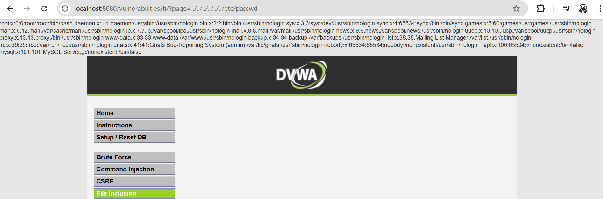

<ins>Explanation of Why it Worked:</ins> At the lowest security, DVWA
directly includes all the user input into the include() function without
any sort of validation. This allows attackers to access sensitive files
on the server by clever tactics.

2.  <ins>Security Level:</ins> Medium

<ins>Payload Used:</ins>
[<ins>http://localhost:8080/vulnerabilities/fi/?page=../../../../../../etc/passwd</ins>](http://localhost:8080/vulnerabilities/fi/?page=../../../../../../etc/passwd)
then
http://localhost:8080/vulnerabilities/fi/?page=..//..//..//..//..//..//etc/passwd

<ins>Result:</ins> System password file exposed

<ins>Screenshots:</ins>

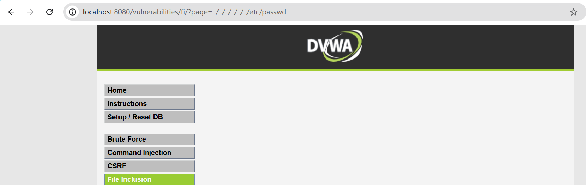

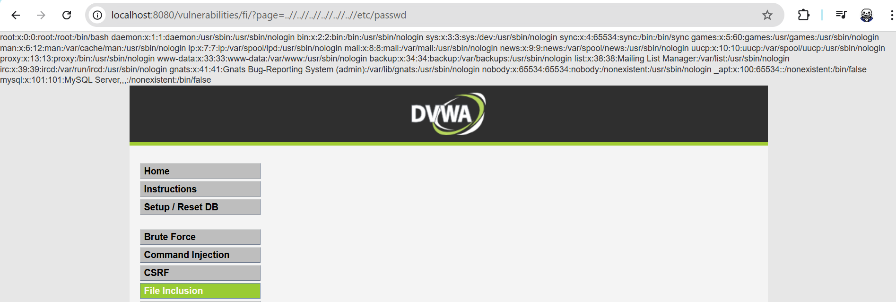

<ins>Explanation of Why it Worked:</ins> Medium security attempts to filter
some of the directory traversal sequences such as "../". However,
attackers can still bypass the filter using alternative path patterns
like "....//". This signifies some sort of validation, but not enough to
keep out real-world attacks.

3.  <ins>Security Level:</ins> High

<ins>Payload Used:</ins>
[<ins>http://localhost:8080/vulnerabilities/fi/?page=../../../../../../etc/passwd</ins>](http://localhost:8080/vulnerabilities/fi/?page=../../../../../../etc/passwd)
then
http://localhost:8080/vulnerabilities/fi/?page=..//..//..//..//..//..//etc/passwd
then finally
http://localhost:8080/vulnerabilities/fi/?page=file:////etc/passwd

<ins>Result:</ins> System password file exposed

<ins>Screenshots:</ins>

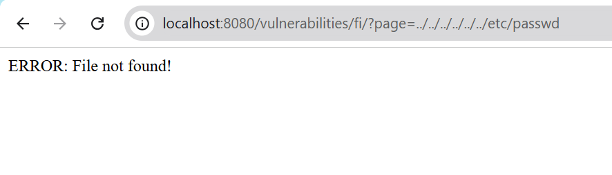

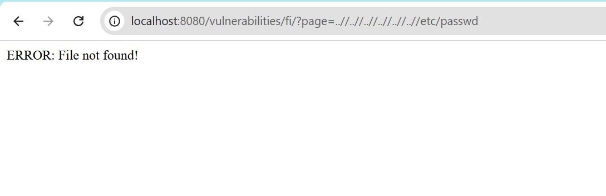

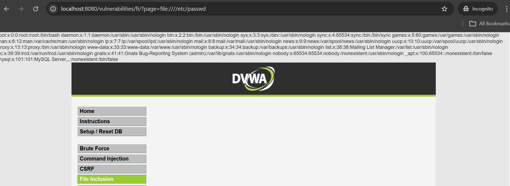

<ins>Explanation of Why it Worked:</ins> High security attempts to restrict file inclusion by being stricter with allowed characters, preventing all sorts of arbitrary file access, but there still exist other ways to perform malicious activity such as trying out URL formats and seeing if they are properly validated. By trying the above mentioned payload, we see that we view a confidential file and hence there is a great need for more security checks.

# **Vulnerability 5: File Upload**

1.  <ins>Security Level:</ins> Low

<ins>Payload Used:</ins> shell.php file with command execution script

<ins>Result:</ins> File uploaded successfully.

<ins>Screenshots:</ins>

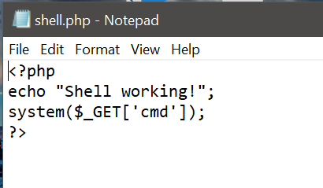

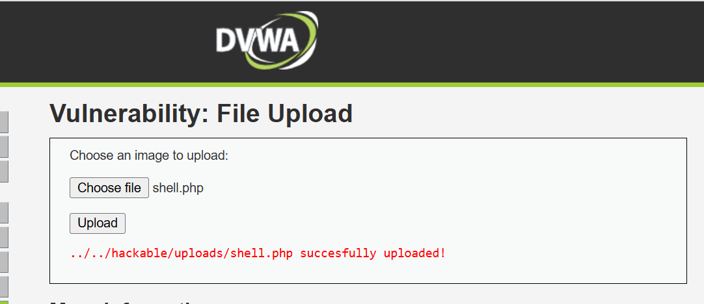

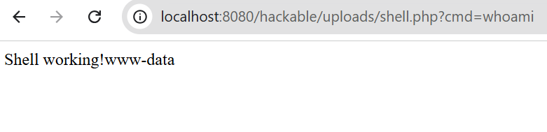

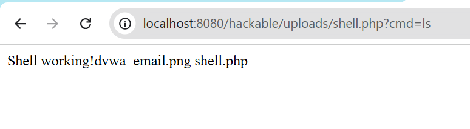

<ins>Explanation of Why it Worked:</ins> There were no checks for extensions
or file MIME type thus executable scripts in .php format could be
uploaded.

2.  <ins>Security Level:</ins> Medium

<ins>Payload Used:</ins> shell.php file with command execution script, then
shell.php.png

<ins>Result:</ins> shell.php.png uploaded successfully.

<ins>Screenshots:</ins>

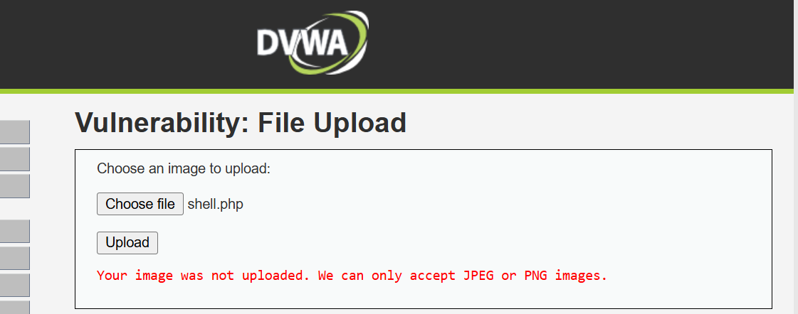

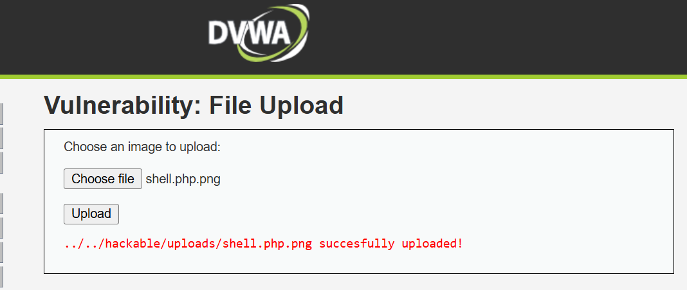

<ins>Explanation of Why it Worked:</ins> Medium security attempts to
restrict uploads based on file extensions and MIME types but we were
still able to upload an invalid/corrupt file with the accepted
extension.

3.  <ins>Security Level:</ins> High

<ins>Payload Used:</ins> shell.php file with command execution script, then
shell.php.png

<ins>Result:</ins> Upload attempts failed.

<ins>Screenshots:</ins>

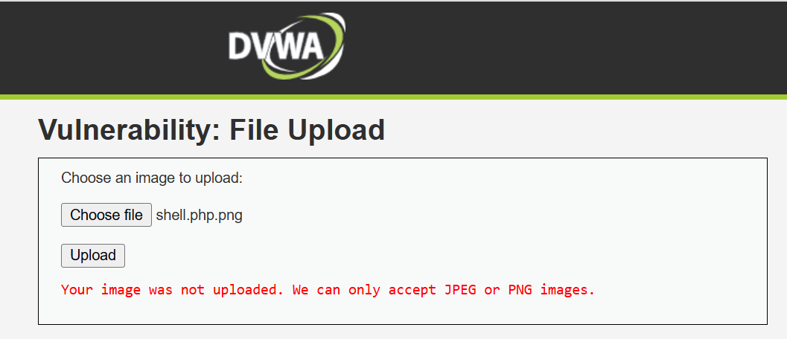

<ins>Explanation of Why it Failed at Higher Level:</ins> There is stricter
validation of file extensions, MIME types, and file content to prevent
malicious/corrupt uploads.

# **Vulnerability 6: Insecure CAPTCHA**

The Insecure CAPTCHA module could not work at first since the DVWA
Docker image did not include a configured Google reCAPTCHA API key.
Therefore, the public and private keys were generated, but trying the
standard attack by changing “step=1” to “step=2” in URL to skip captcha for
password change still did not work, even at low level. A possible reason
can be that adding real services like Google reCAPTCHA can accidentally
patch the vulnerability we were supposed to exploit; it expected a
parameter called “g-recaptcha-response” which had to be a valid value
that DVWA may have attempted to contact Google's verification API for.

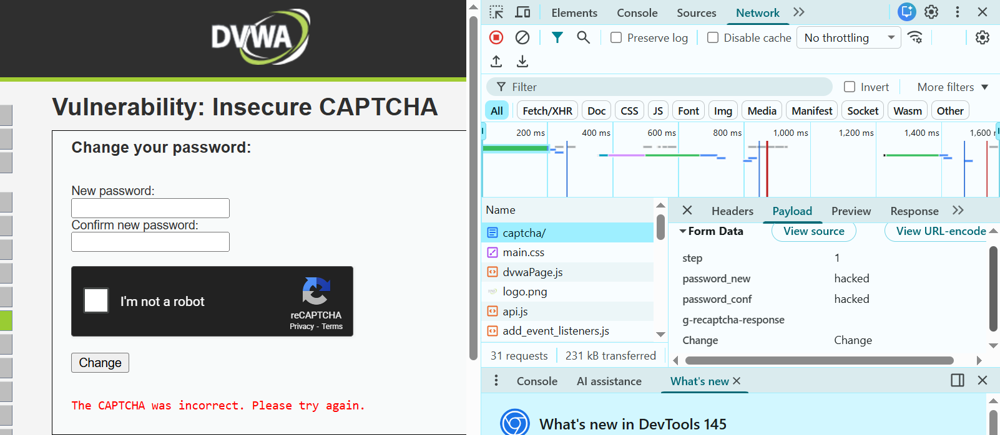

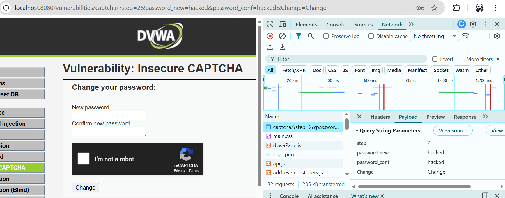

# **Vulnerability 7: SQL Injection**

1.  <ins>Security Level:</ins> Low

<ins>Payload Used:</ins> 1' OR '1'='1

<ins>Result:</ins> Query returns all users of the database

<ins>Screenshots:</ins>

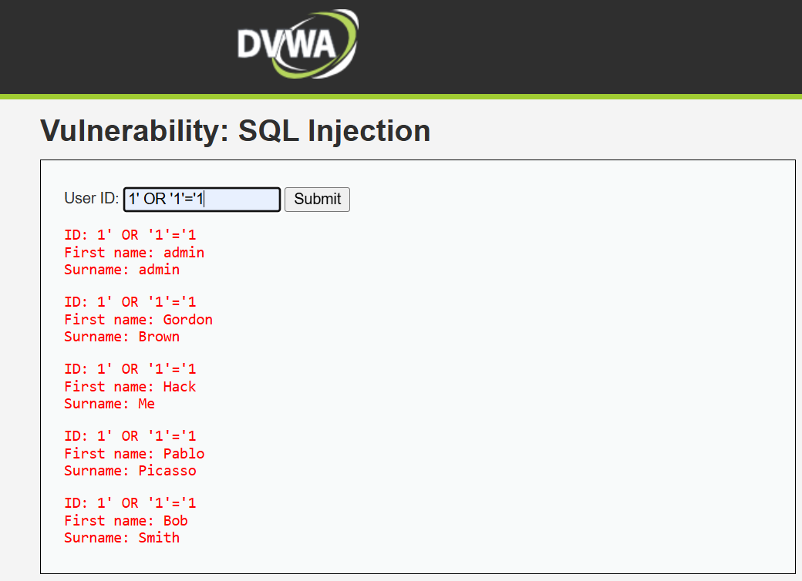

<ins>Explanation of Why it Worked:</ins> Why this works is because the input
is directly inserted into the query, attackers can modify the SQL logic.
As 1=1 is always true, this modifies the query to always evaluate as
true, causing the database to return all user records.

2.  <ins>Security Level:</ins> Medium

<ins>Payload Used:</ins> 1 OR 1=1

<ins>Result:</ins> Query returns all users of the database

<ins>Screenshots:</ins>

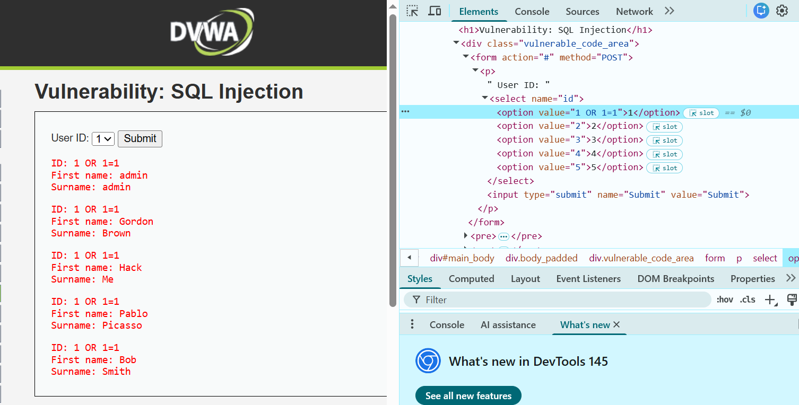

<ins>Explanation of Why it Worked:</ins> At this level the interface switch
from a text input field to a dropdown menu is to try to prevent SQL
injection. The idea is that users can only select IDs instead of typing
malicious input. However, the vulnerability still exists because the
browser can be manipulated.

3.  <ins>Security Level:</ins> High

<ins>Payload Used:</ins> 1’ OR 1=1 \# (hash helps ignore the rest of the SQL
query, this helps in not making the syntax break through the payload)

<ins>Result:</ins> Query returns all users of the database

<ins>Screenshots:</ins>

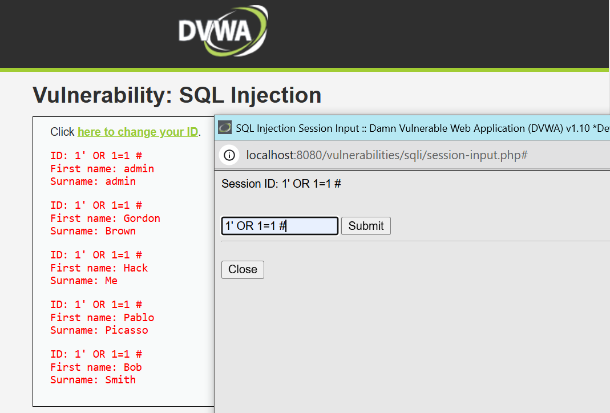

<ins>Explanation of Why it Worked:</ins> The developer tried to make the
attack harder by using a separate popup and limiting visible inputs but
the application still inserts user input directly into SQL queries,
which is the real problem.

# **Vulnerability 8: SQL Injection (Blind)**

1.  <ins>Security Level:</ins> Low

<ins>Payload Used:</ins> 
1' AND 1=1 \#,  
1' AND 1=2 \#,  
1 AND SUBSTRING(database(),1,1)='d' (if first letter of database name is ‘d’)

<ins>Result:</ins> Query reveals injection works, and to ask yes/no
questions

<ins>Screenshots:</ins>

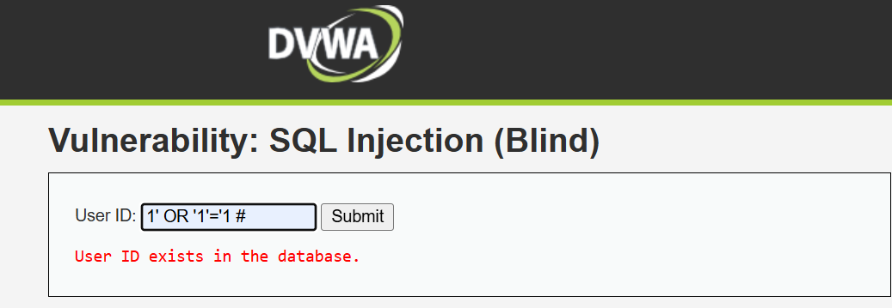

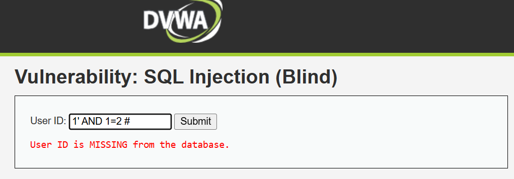

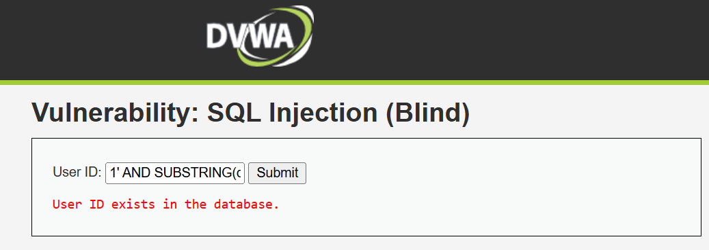

<ins>Explanation of Why it Worked:</ins> A blind SQL Injection occurs when
an application does not display database errors or query results however
it does still allow attackers to manipulate SQL queries. Attackers can
extract database information by asking true/false questions.

2.  <ins>Security Level:</ins> Medium

<ins>Payload Used:</ins> 
1 AND 1=1 \#,  
1 AND 1=2

<ins>Result:</ins> Query reveals injection works through browser
manipulation

<ins>Screenshots:</ins>

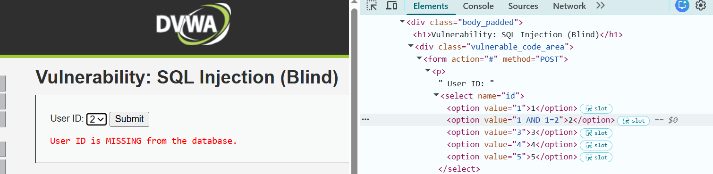

<ins>Explanation of Why it Worked:</ins> At this level the user input field
is replaced with a dropdown menu containing user IDs. However by
modifying the value of the dropdown using Inspect, it is possible to
inject SQL logic such as \`1 AND 1=1\`. Due to lack of validation of
input the injected condition is executed by the database. Again, since
\`1=1\` is always true, the query returns a valid result, confirming
that SQL injection is possible.

3.  <ins>Security Level:</ins> High

<ins>Payload Used:</ins> 1 AND SUBSTRING(database(),1,1)='d'

<ins>Result:</ins> Query reveals injection works and that yes/no questions
can be asked

<ins>Screenshots:</ins>

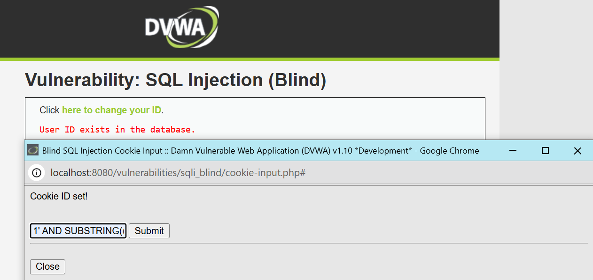

<ins>Explanation of Why it Worked:</ins> The application attempts to make
SQL injection more difficult by moving the user ID input field to a
separate popup window. However, the backend query still involves sending
user input directly into the SQL statement without using parameterized
queries. By inputting the payload, we still get to know the database
name starts with ‘d’.

# **Vulnerability 9: Weak Session IDs**

1.  <ins>Security Level:</ins> Low

<ins>Payload Used:</ins> Clicking “Generate” multiple times

<ins>Result:</ins> The generated session IDs followed a simple incremental
pattern such as: 1, 2, 3, 4, 5, and so on.

<ins>Screenshots:</ins>

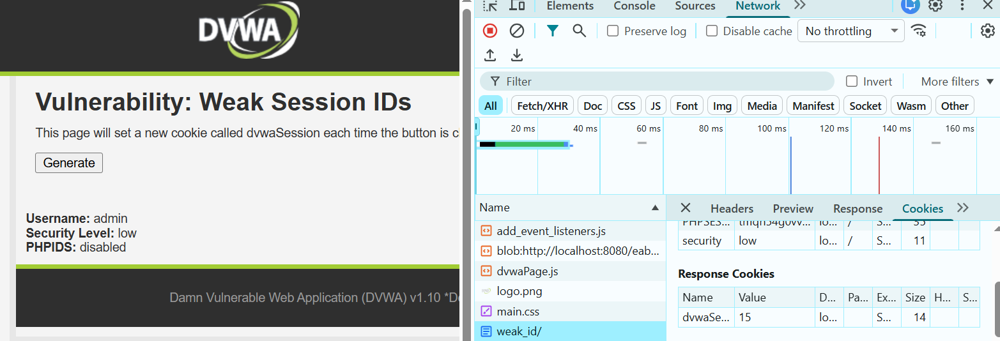

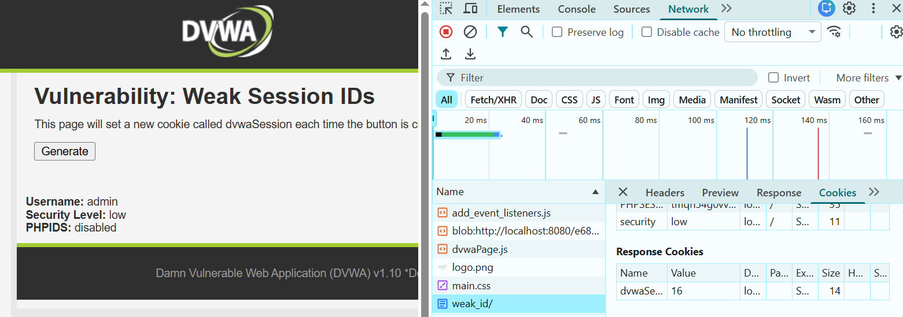

<ins>Explanation of What Happened/Worked:</ins> This generates session IDs
using a very simple sequential counter. Because the values increase very
predictably, an attacker can easily guess valid session IDs belonging to
other users. This makes session hijacking trivial since there is no
randomness in the identifier value.

2.  <ins>Security Level:</ins> Medium

<ins>Payload Used:</ins> Clicking “Generate” multiple times

<ins>Result:</ins> The session IDs appeared less predictable than the Low
security level but still followed a pattern that could be predicted,
based on the numeric values.

<ins>Screenshots:</ins>

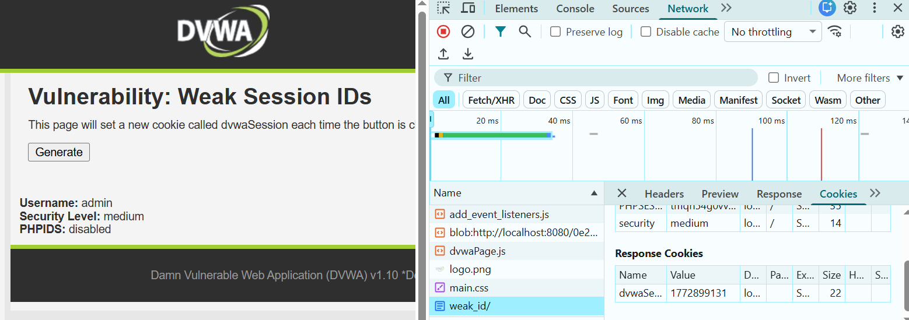


<ins>Explanation of What Happened/Worked:</ins> At the Medium security
level, the application attempts to improve session ID generation by
introducing more variation in the values. However, the IDs are still
generated using a predictable algorithm rather than a known
cryptographically secure random function. They are purely numeric and
lack alphanumeric randomness that can build more trust through security.
By observing several generated IDs, an attacker may still identify
patterns or estimate future values.

3.  <ins>Security Level:</ins> High

<ins>Payload Used:</ins> Clicking “Generate” multiple times

<ins>Result:</ins> The generated session IDs appeared random and did not
follow a visible sequential or predictable pattern.

<ins>Screenshots:</ins>

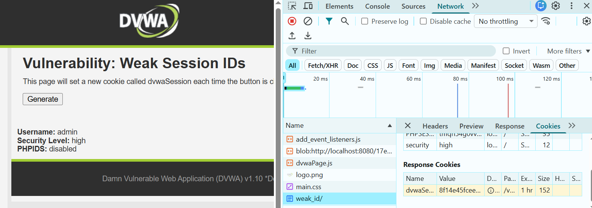

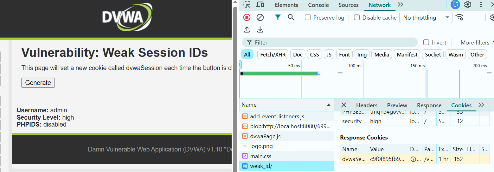

<ins>Explanation of What Happened/Worked:</ins> At the High security level,
the application generates session identifiers using stronger
randomization methods such as hashing or random number generators. These
methods increase entropy and make session IDs significantly harder to
predict.

# **Vulnerability 10: XSS (DOM)**

1.  <ins>Security Level:</ins> Low

<ins>Payload Used:</ins>
[http://localhost:8080/vulnerabilities/xss_d/?default=<script>alert('XSS')\</script>](url)

<ins>Result:</ins> Alert popped up with the text “XSS”

<ins>Screenshots:</ins>

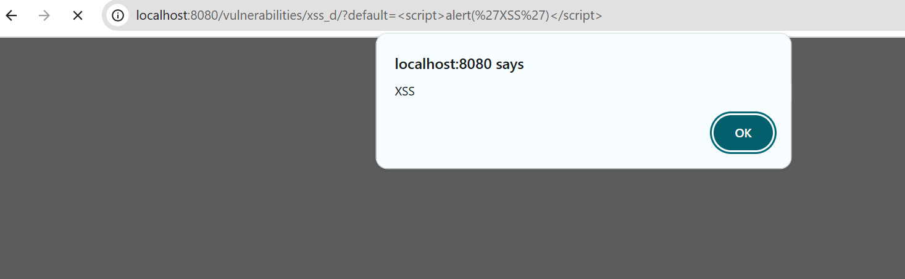

<ins>Explanation of Why it Worked:</ins> At this security level, the page's
JavaScript is reading input from the URL and inserting it into the page
without sanitizing it.

2.  <ins>Security Level:</ins> Medium

<ins>Payload Used:</ins>
[http://localhost:8080/vulnerabilities/xss_d/?default=](url)

<ins>Result:</ins> Alert popped up with the text “XSS”.

<ins>Screenshots:</ins>

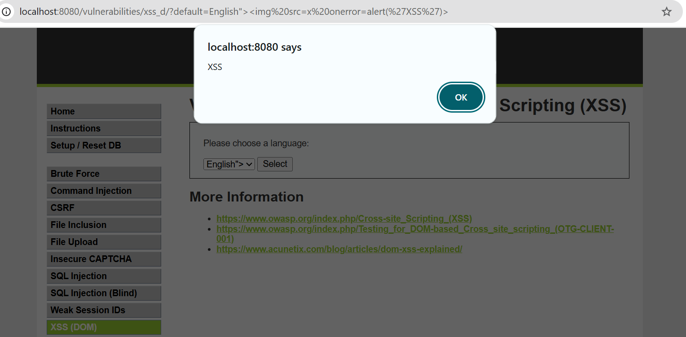

<ins>Explanation of Why it Worked:</ins> At Medium level, DVWA tries to
filter \<script\> tags, but the other HTML elements and event handlers
still work and are not filtered. This payload works because the filter
only blocks \<script\> but does not sanitize event attributes.

3.  <ins>Security Level:</ins> High

[<ins>Payload Used:</ins> http://localhost:8080/vulnerabilities/xss_d/#\](url)

<ins>Result:</ins> Alert popped up with text “XSS”’

<ins>Screenshots:</ins>

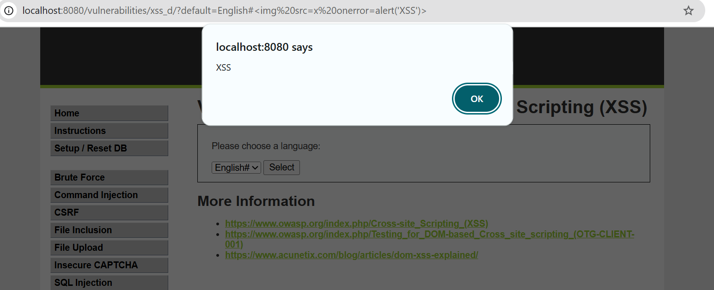

<ins>Explanation of Why it Worked:</ins> Even though DVWA High adds some
filtering,there is still a vulnerability as the application reads the
URL fragment (#) and writes it directly into the page without sanitizing
it. \# is not filtered because the server never sees it and the
vulnerability exists in the client-side JavaScript.

# **Vulnerability 11: XSS (Reflected)**

1.  <ins>Security Level:</ins> Low

<ins>Payload Used:</ins> 
```javascript
<script>alert('XSS')</script>
```

<ins>Result:</ins> Alert notification with text ‘XSS’ popped up

<ins>Screenshots:</ins>

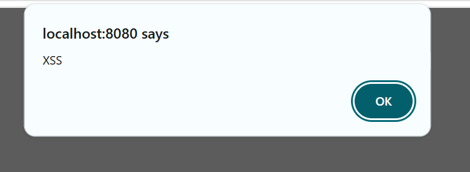

<ins>Explanation of Why it Worked:</ins> The intention here too, is to see
if our injected JavaScript would be run by the page. Here, the input
field has no checks, filtering, or validation, and since this input is
passed to the code directly, the \<script\> tag executes.

2.  <ins>Security Level:</ins> Medium

<ins>Payload Used:</ins> 
```javascript
<script>alert('XSS')</script>
```
then 
```javascript

```

<ins>Result:</ins> Alert notification with text ‘XSS’ popped up

<ins>Screenshots:</ins>

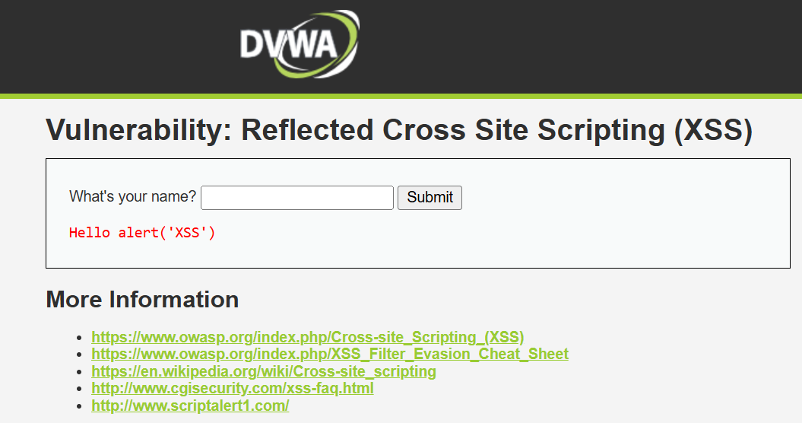

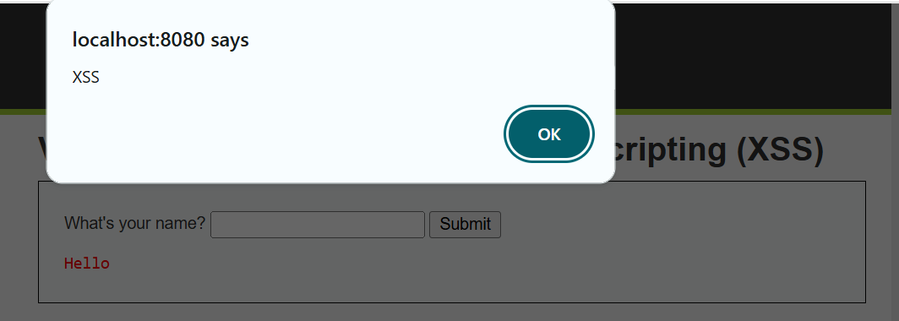

<ins>Explanation of Why it Worked:</ins> The same JavaScript did not run on
this higher security level, likely due to a filter on \<script\> tags.
However, there are quite a few alternatives to making an alert pop up,
one of which was to use an img tag and deliberately give it an invalid
parameter so that its ‘onerror’ attribute would run which prompts an
alert to pop up.

3.  <ins>Security Level:</ins> High

<ins>Payload Used:</ins> 
```javascript

```
and 
```javascript
<autofocus onfocus=alert('XSS')>
```

<ins>Result:</ins> Alert notification with text ‘XSS’ popped up

<ins>Explanation of Why it Worked:</ins> There does not seem to be
significant difference at this level, as both queries listed above ran
without any blocking or issues; alerts popped up both times. The input
validation might have been stricter here, but since the above two inputs
still made the JavaScript run, there is clearly more of a need to ensure
more filtered input.

<ins>Screenshots:</ins>

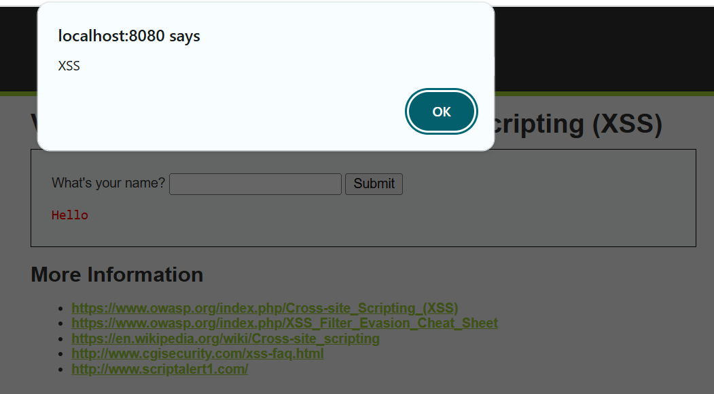

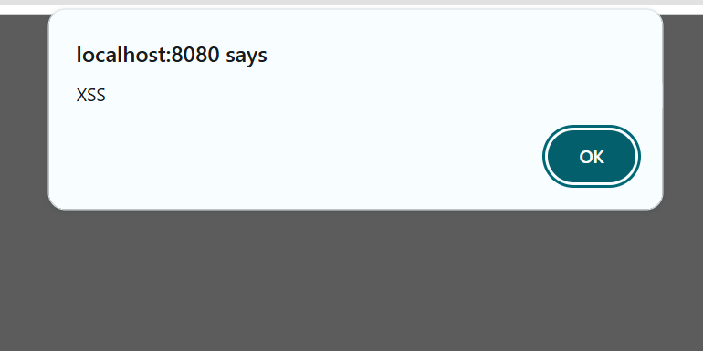

# **Vulnerability 12: XSS (Stored)**

1.  <ins>Security Level:</ins> Low

<ins>Payload Used:</ins> 

```javascript
<script>alert('Stored XSS')</script>
```

<ins>Result:</ins> Alert pop-up with “Stored XSS” as text

<ins>Screenshots:</ins>

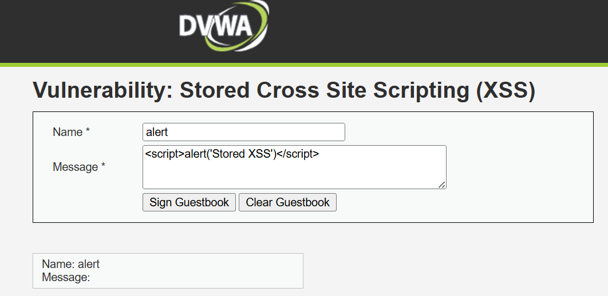

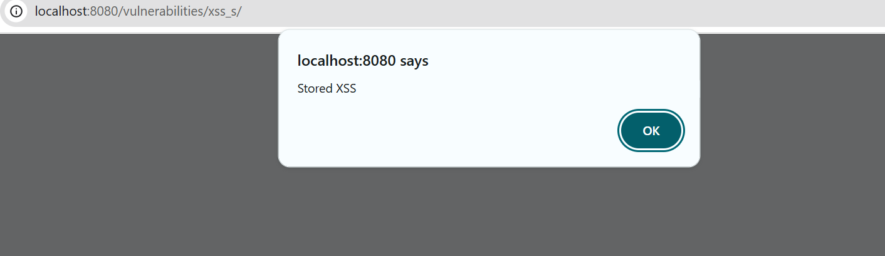

<ins>Explanation of Why it Worked:</ins> Low security does not sanitize
input, so the script is stored in the database and executed. Every time
the page is loaded, it executes unless the database is cleared of the
malicious entries.

2.  <ins>Security Level:</ins> Medium

<ins>Payload Used:</ins>
```javascript
<details open ontoggle=alert(1)>
```

<ins>Result:</ins> Alert pop-up with “1” as text

<ins>Screenshots:</ins>

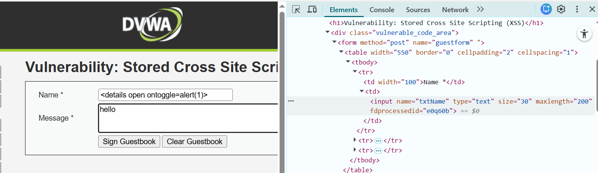

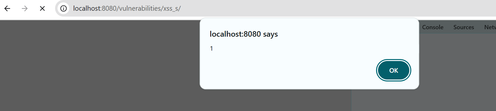

<ins>Explanation of Why it Worked:</ins> There seems to be HTML filtering in
the message field, so we try to use a prompt in the name field instead
(changed max character limit of the field from 10 to 200 through
Inspect) as that field has weak filtering, rendering the application
still vulnerable.

3.  <ins>Security Level:</ins> High

<ins>Payload Used:</ins>
```javascript
<details open ontoggle=alert(1)>
```

<ins>Result:</ins> Alert pop-up with “1” as text

<ins>Screenshots:</ins>

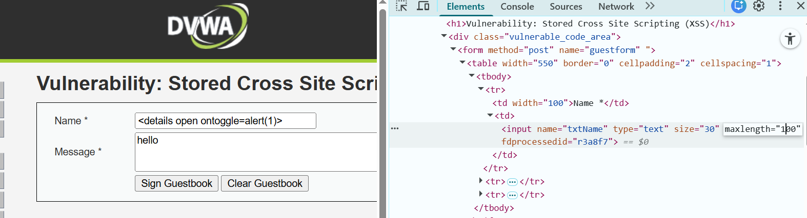

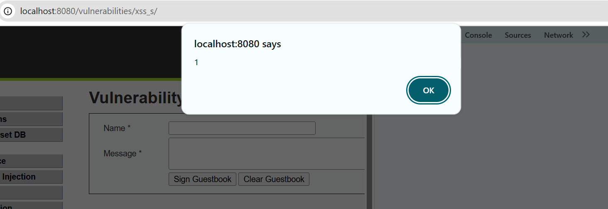

<ins>Explanation of Why it Worked:</ins> Our payload seems to be strong
enough to yield results at this stricter security level as well where
filtering is more intense. The message field was avoided and once again,
the name field was targeted by first manipulating its character limit
and then injecting JS. The name field needs to be secured by input
validation as well, not just the message field.

# **Vulnerability 13: CSP Bypass**

1.  <ins>Security Level:</ins> Low

<ins>Payload Used:</ins> https://code.jquery.com/jquery-3.6.0.min.js

<ins>Result:</ins> jQuery loaded successfully (Status: 200 OK)

<ins>Screenshots:</ins>

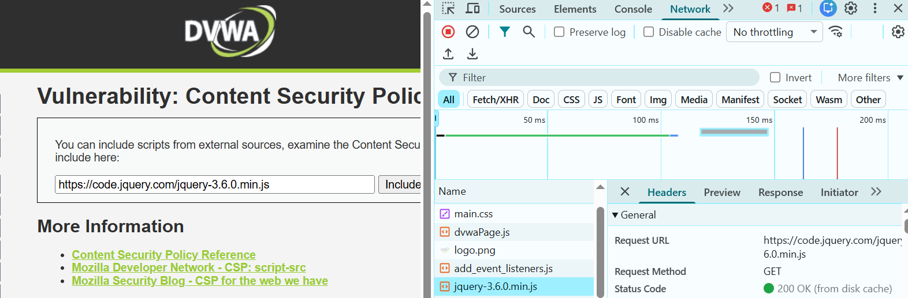

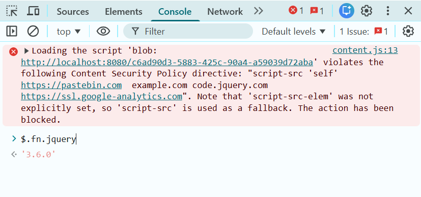

<ins>Explanation of Why it Worked:</ins> The content security policy is
quite poorly configured. Scripts are allowed from external sources like
[<ins>pastebin.com</ins>](http://pastebin.com),
[<ins>code.jquery.com</ins>](http://com.jquery.com) and more which is why
the payload led to successful loading of jQuery. This demonstrates that
if an attacker can host malicious JavaScript on an allowed domain, they
can bypass the CSP restrictions.

2.  <ins>Security Level:</ins> Medium

<ins>Payload Used:</ins>
```javascript
<script nonce="TmV2ZXIgZ29pbmcgdG8gZ2l2ZSB5b3UgdXA=">alert('CSP Bypass')</script>
```

<ins>Result:</ins> Alert popped up with text “CSP Bypass”.

<ins>Screenshots:</ins>

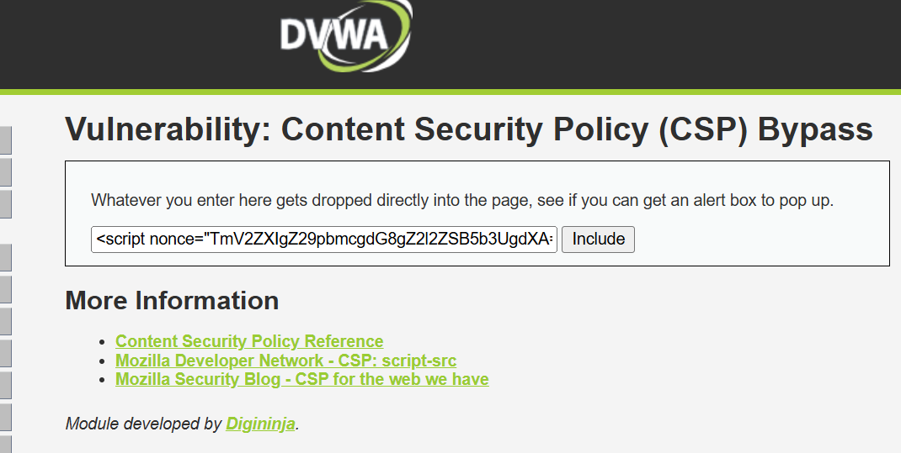

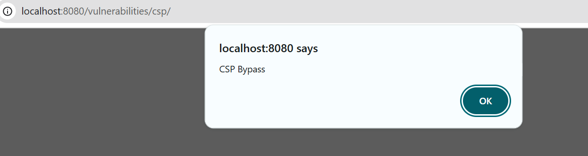

<ins>Explanation of Why it Worked:</ins> A nonce (number used once) is a
random value included in the CSP header that allows only the scripts
that have the same nonce to execute. However, the nonce is visible in
the response headers. An attacker can reuse the same nonce in a
\<script\> tag (since inline JS is allowed here), allowing JavaScript
execution despite the CSP policy.

3.  <ins>Security Level:</ins> High

<ins>Payload Used:</ins>

```javascript
var s = document.createElement("script");
s.src = "/vulnerabilities/csp/source/jsonp.php?callback=console.log";
document.body.appendChild(s);
```

<ins>Result:</ins> Console prints “answer=15” instead of the sum being displayed on the page.

<ins>Screenshots:</ins>

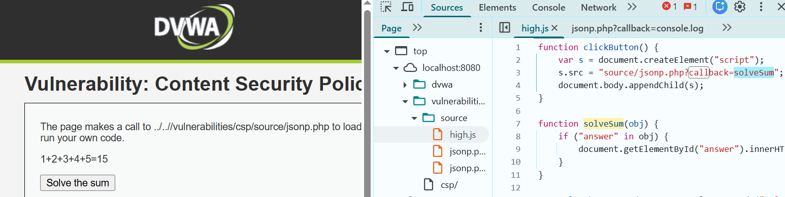

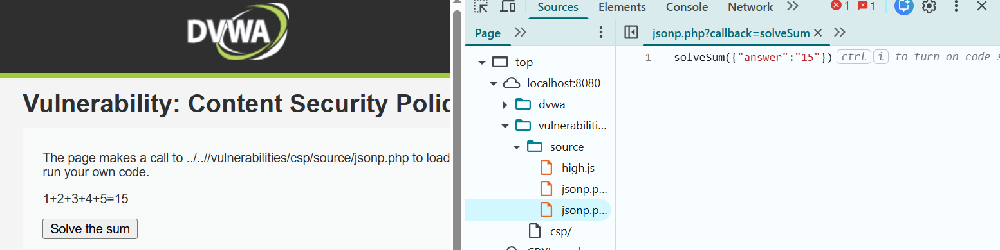

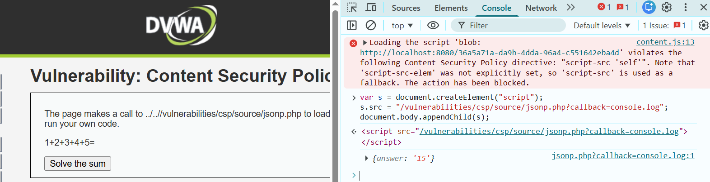

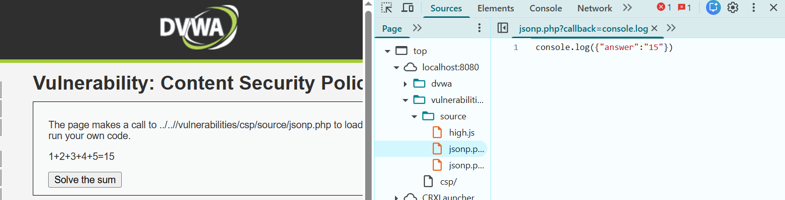

<ins>Explanation of Why it Worked:</ins> The application loads JavaScript
from a JSONP endpoint (jsonp.php) in order to display the sum on the
page. The callback parameter is not validated, which can allow attackers
to inject arbitrary JavaScript functions such as alert or console.log
into the callback. Since the script is served from the same origin, it
bypasses the CSP policy script-src 'self', resulting in code execution.

# **Vulnerability 14: Javascript Attacks**

1.  <ins>Security Level:</ins> Low

<ins>Payload Used:</ins>
```javascript
document.getElementById("phrase").value = "success";
generate_token();
document.getElementById("send").click();
```

<ins>Result:</ins> “Well done” string upon running of script

<ins>Screenshots:</ins>

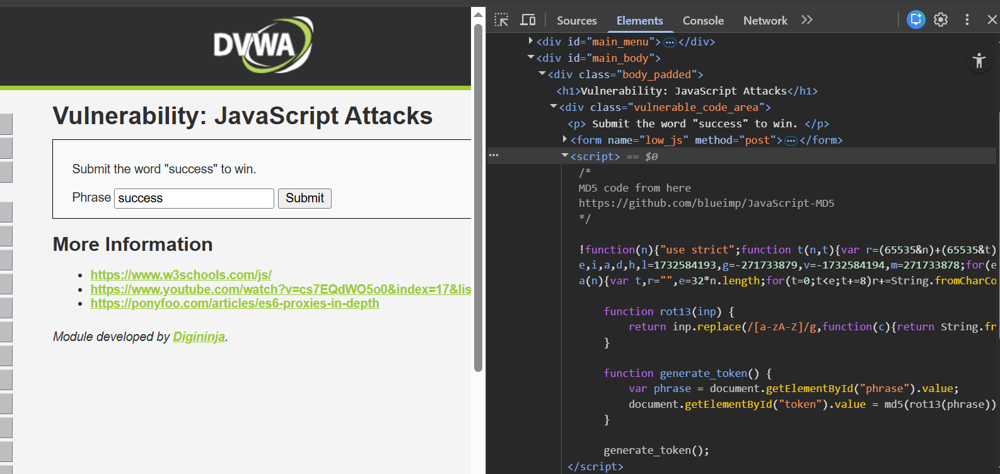

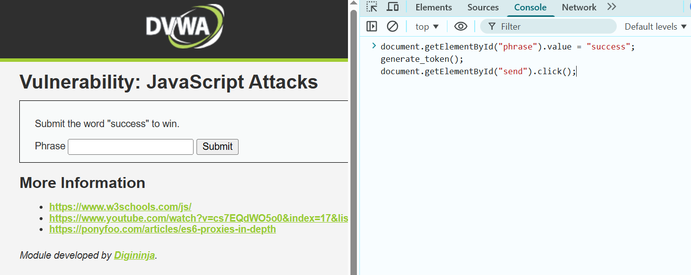

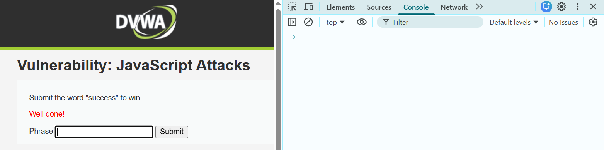

<ins>Explanation of Why it Worked:</ins> The validation was performed on the
client side using JavaScript. By modifying the DOM through the browser
developer console, the restriction could be bypassed. This shows why
security checks must be implemented on the server side rather than
relying on the client‑side.

2.  <ins>Security Level:</ins> Medium
   
<ins>Payload Used:</ins>
```javascript
document.getElementById("phrase").value = "success";
do_elsesomething("XX");
document.getElementById("send").click();
```

<ins>Result:</ins> “Well done” string upon running of script

<ins>Screenshots:</ins>

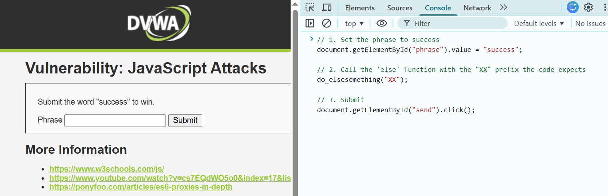

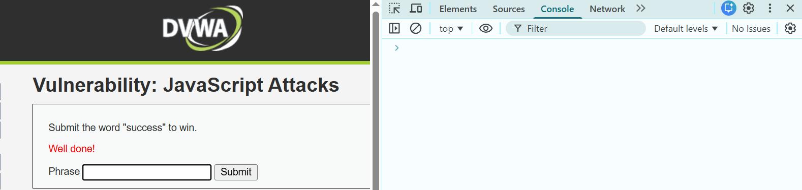

<ins>Explanation of Why it Worked:</ins> In medium level, the \<script\> tag
in the Elements tab no longer contains the logic. Instead, another
script is imported as we see through the following: 
```javascript
<script src="../../vulnerabilities/javascript/source/medium.js</script>
```
so exploiting the function in this file instead does the trick.

3.  <ins>Security Level:</ins> High

<ins>Payload Used:</ins>
```javascript
document.getElementById("phrase").value = "success";
token_part_1("XX");
token_part_2("success");
token_part_3("ZZ");
document.getElementById("send").click();
```
then

```javascript
document.getElementById("phrase").value = "success";
token_part_1("XX");
token_part_2("success");
token_part_3("YY");
document.getElementById("send").click();
```

<ins>Result:</ins> Invalid Token

<ins>Screenshots:</ins>

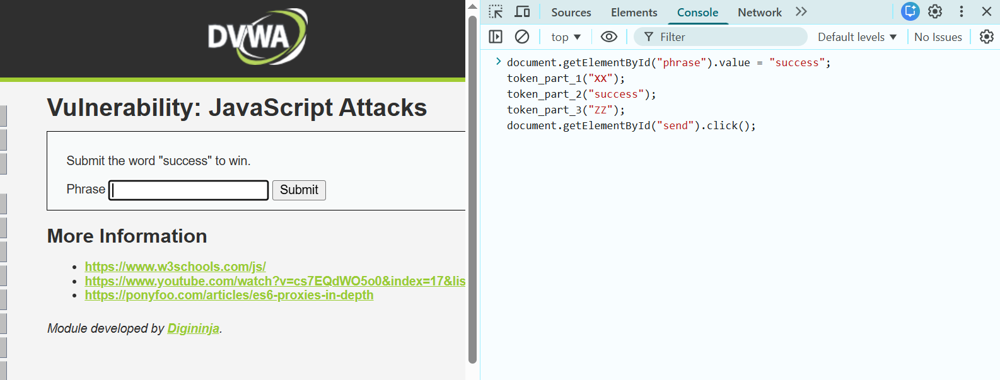

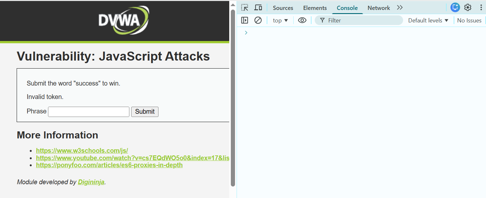

<ins>Explanation of Why it Failed at Higher Level:</ins> There is an attempt
to increase security by an obfuscated script called
[<ins>high.js</ins>](http://high.js) that creates tokens in three separate
functions (i.e. tied to setTimeout loop and an EventListener so manual
manipulation via the Console often fails due to a race condition) which
makes it very difficult to be able to execute scripts that would be sent
with valid tokens.

# **Docker Inspection Tasks:**

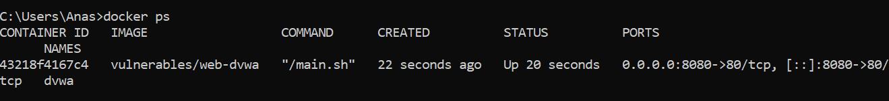

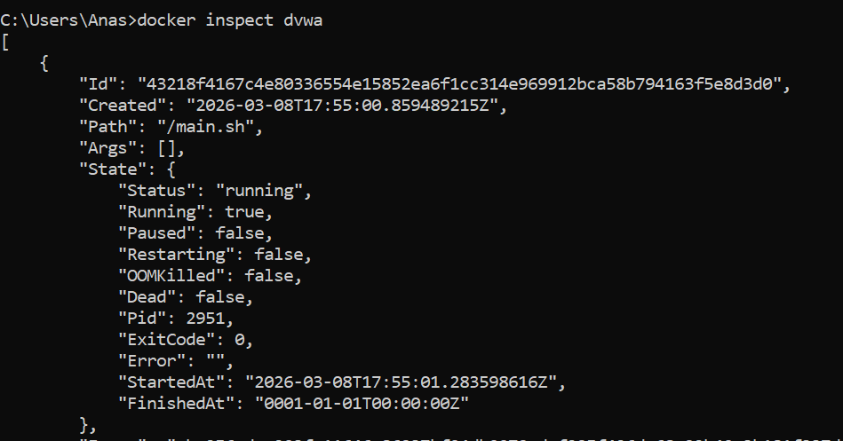

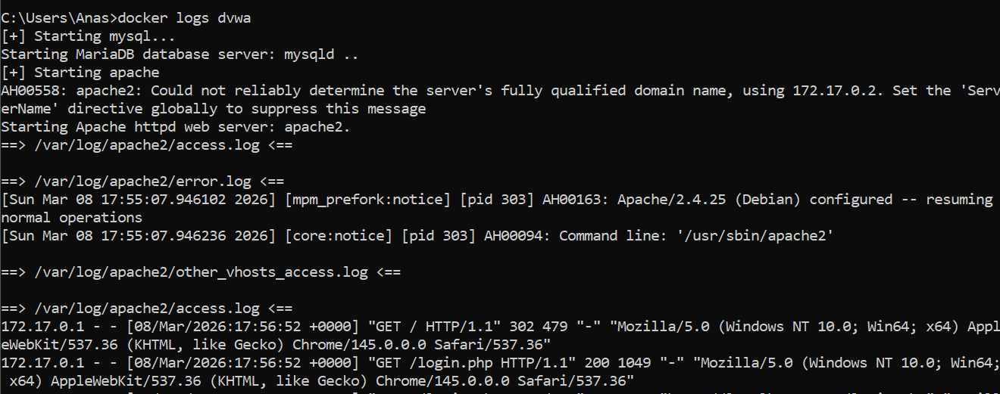

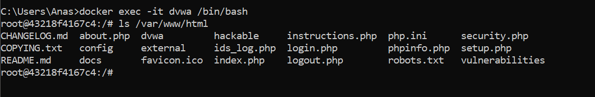

<ins>Where Application Files are Stored:</ins>
The DVWA application files are stored inside the container at
/var/www/html. This directory is the Apache web server’s document root,
which means all the web pages and the application scripts are served
from this important location.

<ins>What Backend Technology DVWA Uses:</ins>
DVWA uses PHP, Apache Web Server and MySQL / MariaDB database since DVWA
is built using PHP and runs on the Apache web server. It connects to a
MySQL database to store user credentials and application data.

<ins>How Docker Isolates the Environment:</ins>
Docker isolates the applications by running them inside containers with
their own filesystems, network stacks, and process spaces. This ensures
that the DVWA applications run independently from the host system and
all the other containers, improving security and also preventing any
dependency conflicts.

# **Security Analysis Questions:**

<ins>Why Does SQL Injection Succeed at Low Security?</ins>\
SQL Injection succeeds at the low security level because the application
directly inserts user input into SQL queries without sort of validation
or sanitization. An example of a vulnerable SQL query is:\
**SELECT \* FROM users WHERE username = '\$user' AND password =
'\$pass';**\
When a malicious injection in inserted into it, it becomes:\
**SELECT \* FROM users WHERE username = '' OR '1'='1';**\
Since '1'='1' is always true, the database returns all results and
authentication is bypassed.

<ins>What Control Prevents it at High?</ins>\
At high security, the injection still succeeded despite the user being
redirected to a new window but usually at a good security level, SQL
Injection is prevented by using parameterized queries input validation.
An example of a safe query is:\
**SELECT \* FROM users WHERE username = ? AND password = ?**\
This makes the database treat user input strictly as data, not
executable SQL.

<ins>Does HTTPS Prevent these Attacks? Why or Why Not?</ins>\
No, HTTPS does not prevent SQL Injection or XSS attacks. HTTPS only
provides: encryption of data that is in transit, protection of integrity
and server authentication.\
It does protect data between the browser and the server, but it does not
validate or sanitize user input. So XSS attacks and SQL injections are
not prevented.

<ins>What Risks Exist if this Application is Deployed Publicly?</ins>
1.  **Data Theft**
Attackers could extract sensitive information such as user credentials,
personal data, database contents, etc.

2.  **Account Takeover**
SQL Injection and authentication bypass could allow attackers to log in
as other users and also gain administrator access.

3.  **Malware or Script Injection**
XSS vulnerabilities could allow attackers to steal session cookies,
redirect users to malicious sites as well as execute malicious scripts
in victims’ browsers.

4.  **Server Compromise**
Command Injection or file vulnerabilities could allow attackers to
execute system commands, upload malicious files and potentially gain
full server access.

5.  **Reputation and Legal Damage**
Public exploitation could lead to loss of user trust, regulatory
penalties, financial losses, etc.

<ins>Mapping Each Vulnerability to its OWASP Top 10 Category:</ins>\
**Bruteforce:** A07: Authentication Failures\
**Command Injection:** A05: Injection\
**CSRF:** A01: Broken Access Control\
**File Inclusion:** A05: Injection\
**File Upload:** A06: Insecure Design / A05: Injection\
**Insecure CAPTCHA:** A07: Authentication Failures\
**SQL Injection:** A05: Injection\
**SQL Injection (Blind):** A05: Injection\
**Weak Session IDs:** A07: Authentication Failures\
**XSS (DOM):** A05: Injection\
**XSS (Reflected):** A05: Injection\
**XSS (Stored):** A05: Injection\
**CSP Bypass:** A02: Security Misconfiguration\
**JavaScript:** Usually leads to A05: Injection

# **Bonus Task:**

A docker network was first set up and dvwa was made to run on it.

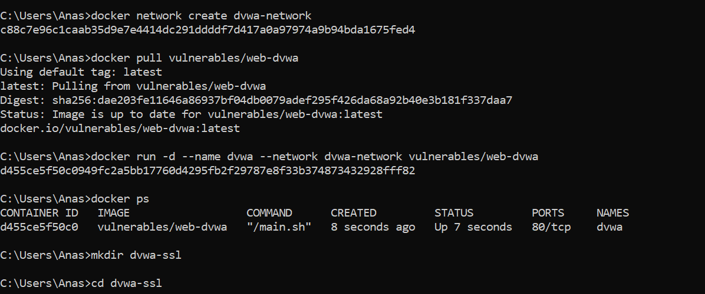

Then we make two directories, folderssl will have parts of our
certificate and foldernginx will have our required config file for
nginx.

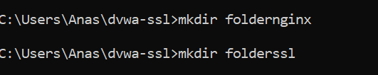

Generating dvwa.crt and dvwa.key:

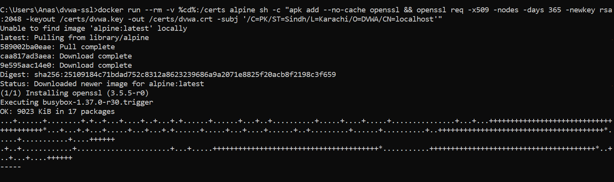

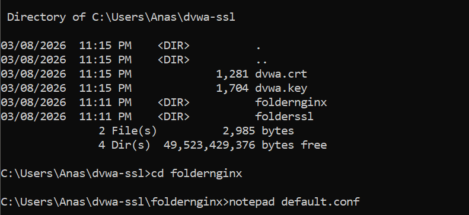

Editing config file:

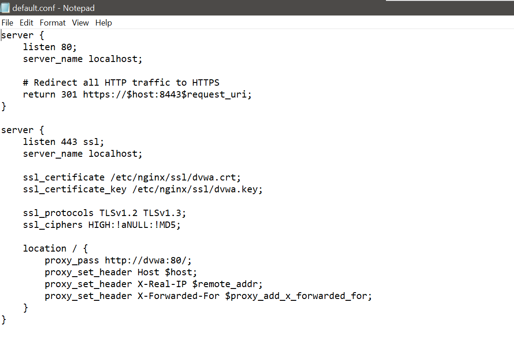

Moving the certificate files from root to folderssl:

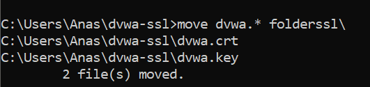

Using the config file and the certificate files on the network:

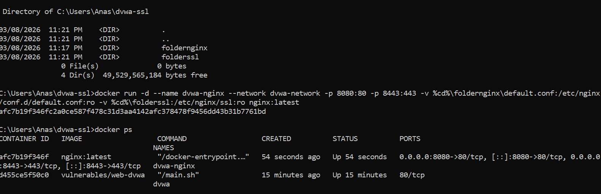

Using the curl command for https://localhost:8443:

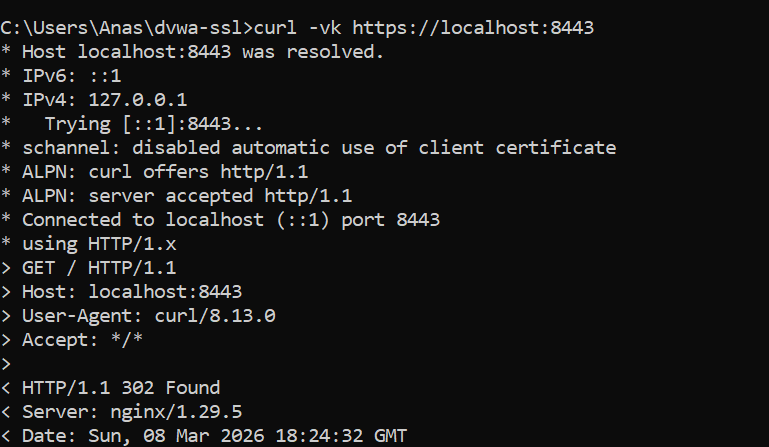

[<ins>https://localhost:8443</ins>](https://localhost:443) view in the
browser:

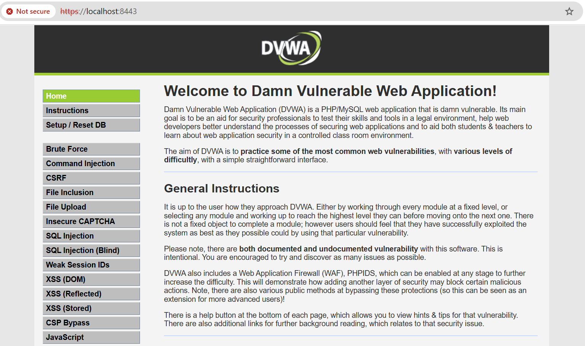

Difference between HTTP and HTTPS traffic is as follows:

| **Feature** | **HTTP** | **HTTPS** |
|----|----|----|
| Encryption | None | TLS encryption |
| Data security | Plain text which can be intercepted easily | Encrypted and secure in transit |
| Server identity verification | None | Verified via a certificate |
| Use case | Local testing | Login forms and for sensitive data |

For example we can see that a certificate is linked with an address with
https:

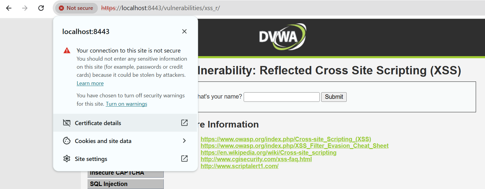

Meanwhile with http, there isn't any certificate:

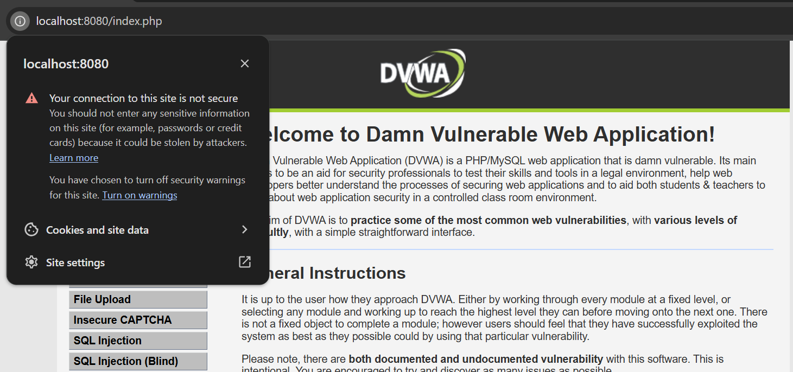
