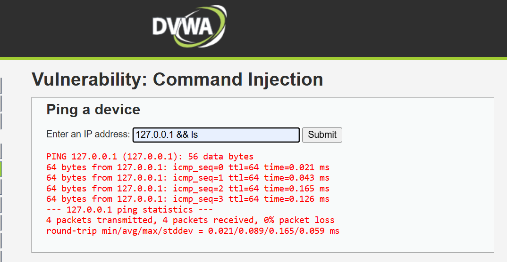
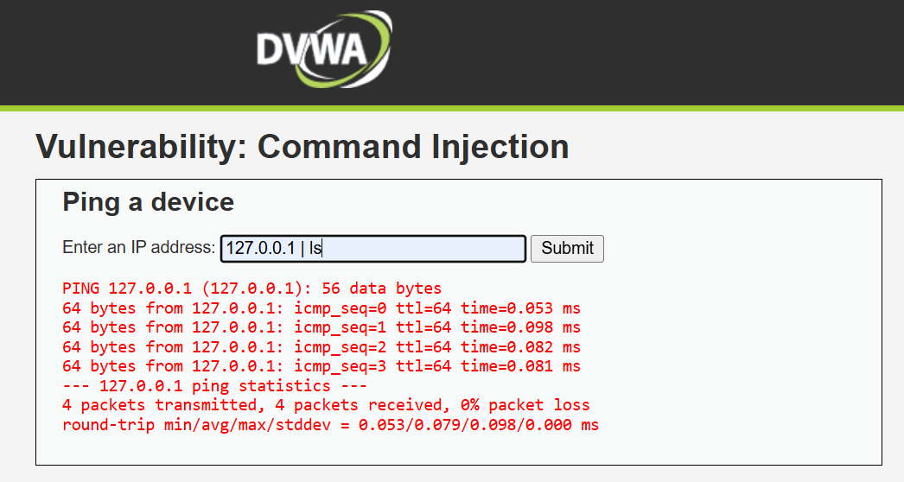
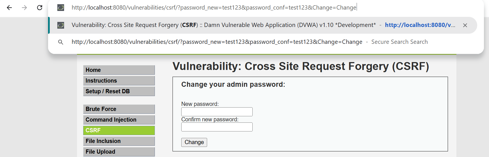
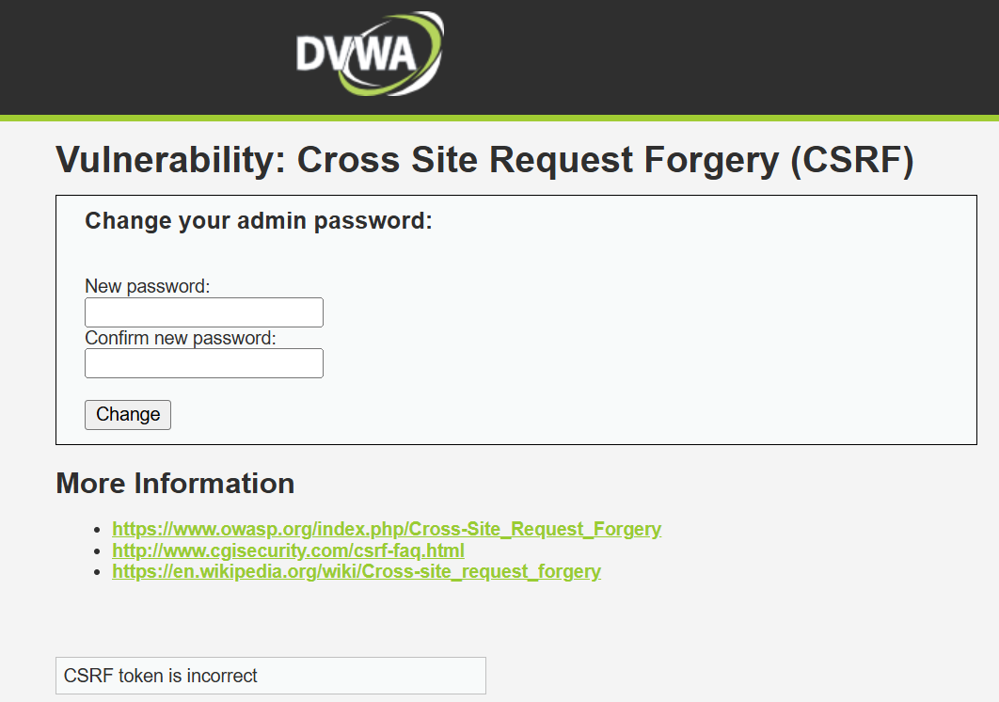

**Vulnerability 1: Bruteforce**

a.  [Security Level:]{.underline} Low

[Payload Used:]{.underline} Input used (Username/Password):
admin/password

[Result:]{.underline} Login successful (failed on some prior attempts)

[Screenshots:]{.underline}

{width="5.036458880139983in"
height="2.7106517935258094in"}

{width="5.096449037620298in"
height="3.1493000874890638in"}

[Explanation of why it worked:]{.underline} At the low security, DVWA
does not implement any protection against repeated login attempts. There
is no rate limit, account lockout, or other such measures. Therefore
attackers can attempt password guesses unlimited times. Also username
and password are being exposed in cleartext within the URL query string
(?username=admin&password=password) as they are sent through a GET
request by the application.

b.  [Security Level:]{.underline} Medium

[Payload Used:]{.underline} admin/password

[Result:]{.underline} Login successful (failed a few prior times)

[Screenshots:]{.underline}

{width="4.873275371828521in"
height="2.5473939195100614in"}

{width="4.8995909886264215in"
height="3.026218285214348in"}

[Explanation of why it worked:]{.underline} There were some levels of
measures taken to prevent repeated attempts such as delay in
verification of credentials. However, there were no measures taken to
limit the number of attempts for added security. Here as well, username
and password are being exposed in cleartext within the URL query string
(?username=admin&password=password). Only basic brute-force mitigation
is observed.

c.  [Security Level:]{.underline} High

[Payload Used:]{.underline} admin/password

[Result:]{.underline} Login successful (failed on prior attempts)

[Screenshots:]{.underline}

{width="5.223958880139983in"
height="2.75082239720035in"}

{width="5.295515091863517in"
height="3.1051771653543305in"}

[Explanation of why it worked:]{.underline} There were also some delays
here to prevent continuous repeated attempts but measures like rate
limiting were still not observed at this higher security level. CAPTCHA
verification, request throttling, etc. were also not there, but the
attack becomes more expensive with respect to time to execute. Username
and password are still visible in the URL after attempt.

[Explanation of why it would fail at even higher level:]{.underline} The
attack worked on all three levels, it just took more time in the medium
and high levels due to the delay between attempts. Although this
increases the time required for brute forcing, it does not fully prevent
the attack because there is still no strict limit on the number of login
attempts.

**Vulnerability 2: Command Injection**

a.  [Security Level:]{.underline} Low

[Payload Used:]{.underline} 127.0.0.1; ls

[Result:]{.underline} After execution of the ping command, directory
listing of the server is also displayed.

[Screenshots:]{.underline}

{width="6.145833333333333in" height="3.28125in"}

{width="6.267716535433071in"
height="2.9583333333333335in"}

[Explanation of why it worked:]{.underline} The application just inserts
user input into a system command without any sort of validation. This
allows attackers to append additional commands using shell separators
like \';\'.

b.  [Security Level:]{.underline} Medium

[Payload Used:]{.underline} 127.0.0.1; ls and then 127.0.0.1&& and then
ls 127.0.0.1 \| ls

[Result:]{.underline} The ";" character seems to be filtered but the
pipe operator seems to do the job by giving us the directory listing

[Screenshots:]{.underline}

{width="6.267716535433071in"
height="3.4166666666666665in"}

{width="6.267716535433071in"
height="2.5972222222222223in"}

[Explanation of why it worked:]{.underline} Only some special characters
are filtered at this security level, the input still isn't fully
validated resulting in possibilities to still bypass the filtering.

c.  [Security Level:]{.underline} High

[Payload Used:]{.underline} 127.0.0.1; ls and then 127.0.0.1&& and then
ls 127.0.0.1 \| ls

[Result:]{.underline}

Command injection attempts failed.

[Screenshots:]{.underline}

{width="6.255208880139983in"
height="3.3022419072615925in"}

{width="6.267716535433071in"
height="3.3472222222222223in"}

[Explanation of why it failed at a higher level:]{.underline} Pretty
much all special characters seem to be filtered at this security level.
This input validation prevents additional commands from being executed.

**Vulnerability 3: CSRF**

a.  [Security Level:]{.underline} Low

[Payload Used:]{.underline}
http://localhost:8080/vulnerabilities/csrf/?password_new=test123&password_conf=test123&Change=Change

[Result:]{.underline} Password change successful

[Screenshots:]{.underline}

{width="6.267716535433071in"
height="2.0416666666666665in"}

{width="6.267716535433071in" height="3.375in"}

[Explanation of Why it Worked:]{.underline} At the lowest security, DVWA
does not implement any CSRF token validation. The server accepts
requests without verifying their origin at all.

b.  [Security Level:]{.underline} Medium

[Payload Used:
<http://localhost:8080/vulnerabilities/csrf/?password_new=test123&password_conf=test123&Change=Change>]{.underline}
and then

\<form action=\"http://dvwa/vulnerabilities/csrf/\" method=\"GET\"\>
\<input type=\"hidden\" name=\"password_new\" value=\"hacked123\"\>
\<input type=\"hidden\" name=\"password_conf\" value=\"hacked123\"\>
\<input type=\"hidden\" name=\"Change\" value=\"Change\"\> \</form\>
\<script\> document.forms\[0\].submit(); \</script\> in a new html file

[Result:]{.underline} Password change failed on both attempts

[Screenshots:]{.underline}

{width="6.267716535433071in"
height="2.013888888888889in"}

{width="6.267716535433071in"
height="3.2222222222222223in"}

[Explanation of Why It Failed at Higher Security Level:]{.underline}
DVWA introduces a CSRF token that must be included along with the
request. Since the forged request does not contain the correct token
that is needed, the server rejects it.

c.  [Security Level:]{.underline} High

[Payload Used:
<http://localhost:8080/vulnerabilities/csrf/?password_new=test123&password_conf=test123&Change=Change>]{.underline}
and then

\<form action=\"http://dvwa/vulnerabilities/csrf/\" method=\"GET\"\>
\<input type=\"hidden\" name=\"password_new\" value=\"hacked123\"\>
\<input type=\"hidden\" name=\"password_conf\" value=\"hacked123\"\>
\<input type=\"hidden\" name=\"Change\" value=\"Change\"\> \</form\>
\<script\> document.forms\[0\].submit(); \</script\> in a new html file

[Result:]{.underline} Password change failed

[Screenshots:]{.underline}

{width="5.609375546806649in"
height="1.7983541119860018in"}

{width="5.609375546806649in"
height="3.933266622922135in"}

[Explanation of Why It Failed at Higher Security Level:]{.underline}
Attack fails here again due to the fact that there is strict token
validation tied to the user session.

**Vulnerability 4: File Inclusion**

a.  [Security Level:]{.underline} Low

[Payload Used:]{.underline}
http://localhost:8080/vulnerabilities/fi/?page=../../../../../../etc/passwd

[Result:]{.underline} System password file exposed

[Screenshots:]{.underline}

{width="5.859375546806649in"
height="1.9399278215223097in"}

[Explanation of Why it Worked:]{.underline} At the lowest security, DVWA
directly includes all the user input into the include() function without
any sort of validation. This allows attackers to access sensitive files
on the server by clever tactics.

b.  [Security Level:]{.underline} Medium

[Payload Used:]{.underline}
[[http://localhost:8080/vulnerabilities/fi/?page=../../../../../../etc/passwd]{.underline}](http://localhost:8080/vulnerabilities/fi/?page=../../../../../../etc/passwd)
then
http://localhost:8080/vulnerabilities/fi/?page=..//..//..//..//..//..//etc/passwd

[Result:]{.underline} System password file exposed

[Screenshots:]{.underline}

{width="5.557292213473316in"
height="1.7631933508311461in"}

{width="6.267716535433071in"
height="2.111111111111111in"}

[Explanation of Why it Worked:]{.underline} Medium security attempts to
filter some of the directory traversal sequences such as \"../\".
However, attackers can still bypass the filter using alternative path
patterns like \"\....//\". This signifies some sort of validation, but
not enough to keep out real-world attacks.

c.  [Security Level:]{.underline} High

[Payload Used:]{.underline}
[[http://localhost:8080/vulnerabilities/fi/?page=../../../../../../etc/passwd]{.underline}](http://localhost:8080/vulnerabilities/fi/?page=../../../../../../etc/passwd)
then
http://localhost:8080/vulnerabilities/fi/?page=..//..//..//..//..//..//etc/passwd

[Result:]{.underline} System password file not exposed

[Screenshots:]{.underline}

{width="6.267716535433071in"
height="1.7916666666666667in"}

{width="6.267716535433071in"
height="2.0277777777777777in"}

[Explanation of Why it Failed at Higher Level:]{.underline} High
security restricts file inclusion to specific allowed files, preventing
all sorts of arbitrary file access.

**Vulnerability 5: File Upload**

a.  [Security Level:]{.underline} Low

[Payload Used:]{.underline} shell.php file with command execution script

[Result:]{.underline} File uploaded successfully.

[Screenshots:]{.underline}

{width="4.270833333333333in"
height="2.4895833333333335in"}

{width="4.686053149606299in"
height="2.114215879265092in"}

{width="4.706271872265967in"
height="1.1284044181977253in"}

{width="4.630208880139983in"
height="1.269076990376203in"}

[Explanation of Why it Worked:]{.underline} There were no checks for
extensions or file MIME type thus executable scripts in .php format
could be uploaded.

b.  [Security Level:]{.underline} Medium

[Payload Used:]{.underline} shell.php file with command execution
script, then shell.php.png

[Result:]{.underline} shell.php.png uploaded successfully.

[Screenshots:]{.underline}

{width="5.9375in" height="2.46875in"}

{width="6.083333333333333in" height="2.65625in"}

[Explanation of Why it Worked:]{.underline} Medium security attempts to
restrict uploads based on file extensions and MIME types but we were
still able to upload an invalid/corrupt file with the accepted
extension.

c.  [Security Level:]{.underline} High

[Payload Used:]{.underline} shell.php file with command execution
script, then shell.php.png

[Result:]{.underline} Upload attempts failed.

[Screenshots:]{.underline}

{width="6.267716535433071in"
height="2.7083333333333335in"}

[Explanation of Why it Failed at Higher Level:]{.underline} There is
stricter validation of file extensions, MIME types, and file content to
prevent malicious uploads.

**Vulnerability 6: Insecure CAPTCHA**

The Insecure CAPTCHA module could not work at first since the DVWA
Docker image did not include a configured Google reCAPTCHA API key.
Therefore, the public and private keys were generated, but trying the
standard attack by changing "step=1" to "step=2" to skip captcha for
password change still did not work, even at low level. A possible reason
can be that adding real services like Google reCAPTCHA can accidentally
patch the vulnerability we were supposed to exploit; it expected a
parameter called "g-recaptcha-response" which had to be a valid value
that DVWA may have attempted to contact Google\'s verification API for.

{width="6.135416666666667in"
height="2.7395833333333335in"}

{width="6.267716535433071in"
height="2.4583333333333335in"}

**Vulnerability 7: SQL Injection**

a.  [Security Level:]{.underline} Low

[Payload Used:]{.underline} 1\' OR \'1\'=\'1

[Result:]{.underline} Query returns all users of the database

[Screenshots:]{.underline}

{width="5.612216754155731in"
height="4.064662073490814in"}

[Explanation of Why it Worked:]{.underline} Why this works is because
the input is directly inserted into the query, attackers can modify the
SQL logic. As 1=1 is always true, this modifies the query to always
evaluate as true, causing the database to return all user records.

b.  [Security Level:]{.underline} Medium

[Payload Used:]{.underline} 1 OR 1=1

[Result:]{.underline} Query returns all users of the database

[Screenshots:]{.underline}

{width="5.338542213473316in"
height="2.7047430008748905in"}

[Explanation of Why it Worked:]{.underline} At this level the interface
switch from a text input field to a dropdown menu is to try to prevent
SQL injection. The idea is that users can only select IDs instead of
typing malicious input. However, the vulnerability still exists because
the browser can be manipulated.

c.  [Security Level:]{.underline} High

[Payload Used:]{.underline} 1' OR 1=1 \# (hash helps ignore the rest of
the SQL query, this helps in not making the syntax break through the
payload)

[Result:]{.underline} Query returns all users of the database

[Screenshots:]{.underline}

{width="4.643540026246719in"
height="3.138873578302712in"}

[Explanation of Why it Worked:]{.underline} The developer tried to make
the attack harder by using a separate popup and limiting visible inputs
but the application still inserts user input directly into SQL queries,
which is the real problem.

**Vulnerability 8: SQL Injection (Blind)**

a.  [Security Level:]{.underline} Low

[Payload Used:]{.underline} 1\' AND 1=1 #, 1\' AND 1=2 #, 1 AND
SUBSTRING(database(),1,1)=\'d\' (if first letter of database name is
'd')

[Result:]{.underline} Query reveals injection works, and to ask yes/no
questions

[Screenshots:]{.underline}

{width="6.267716535433071in"
height="2.1666666666666665in"}

{width="6.267716535433071in"
height="2.1805555555555554in"}

{width="6.267716535433071in"
height="2.2222222222222223in"}

[Explanation of Why it Worked:]{.underline} A blind SQL Injection occurs
when an application does not display database errors or query results
however it does still allow attackers to manipulate SQL queries.
Attackers can extract database information by asking true/false
questions.

b.  [Security Level:]{.underline} Medium

[Payload Used:]{.underline} 1 AND 1=1 #, 1 AND 1=2

[Result:]{.underline} Query reveals injection works through browser
manipulation

[Screenshots:]{.underline}

{width="6.15625in" height="1.53125in"}

[Explanation of Why it Workedl:]{.underline} At this level the user
input field is replaced with a dropdown menu containing user IDs.
However by modifying the value of the dropdown using Inspect, it is
possible to inject SQL logic such as \`1 AND 1=1\`. Due to lack of
validation of input the injected condition is executed by the database.
Again, since \`1=1\` is always true, the query returns a valid result,
confirming that SQL injection is possible.

c.  [Security Level:]{.underline} High

[Payload Used:]{.underline} 1 AND SUBSTRING(database(),1,1)=\'d\'

[Result:]{.underline} Query reveals injection works and that yes/no
questions can be asked

[Screenshots:]{.underline}

{width="6.267716535433071in"
height="2.9722222222222223in"}

[Explanation of Why it Worked:]{.underline} The application attempts to
make SQL injection more difficult by moving the user ID input field to a
separate popup window. However, the backend query still involves sending
user input directly into the SQL statement without using parameterized
queries. By inputting the payload, we still get to know the database
name starts with 'd'.

**Vulnerability 9: Weak Session IDs**

a.  [Security Level:]{.underline} Low

[Payload Used:]{.underline} Clicking "Generate" multiple times

[Result:]{.underline} The generated session IDs followed a simple
incremental pattern such as: 1, 2, 3, 4, 5, and so on.

[Screenshots:]{.underline}

{width="6.267716535433071in"
height="2.138888888888889in"}

{width="6.267716535433071in"
height="2.2083333333333335in"}

[Explanation of What Happened/Worked:]{.underline} This generates
session IDs using a very simple sequential counter. Because the values
increase very predictably, an attacker can easily guess valid session
IDs belonging to other users. This makes session hijacking trivial since
there is no randomness in the identifier value.

b.  [Security Level:]{.underline} Medium

[Payload Used:]{.underline} Clicking "Generate" multiple times

[Result:]{.underline} The session IDs appeared less predictable than the
Low security level but still followed a pattern that could be predicted,
based on the numeric values.

[Screenshots:]{.underline}

{width="6.267716535433071in"
height="2.2083333333333335in"}

{width="6.267716535433071in"
height="2.2222222222222223in"}

[Explanation of What Happened/Worked:]{.underline} At the Medium
security level, the application attempts to improve session ID
generation by introducing more variation in the values. However, the IDs
are still generated using a predictable algorithm rather than a known
cryptographically secure random function. They are purely numeric and
lack alphanumeric randomness that can build more trust through security.
By observing several generated IDs, an attacker may still identify
patterns or estimate future values.

c.  [Security Level:]{.underline} High

[Payload Used:]{.underline} Clicking "Generate" multiple times

[Result:]{.underline} The generated session IDs appeared random and did
not follow a visible sequential or predictable pattern.

[Screenshots:]{.underline}

{width="6.267716535433071in"
height="2.2083333333333335in"}

{width="6.267716535433071in"
height="2.1944444444444446in"}

[Explanation of What Happened/Worked:]{.underline} At the High security
level, the application generates session identifiers using stronger
randomization methods such as hashing or random number generators. These
methods increase entropy and make session IDs significantly harder to
predict.

**Vulnerability 10: XSS (DOM)**

a.  [Security Level:]{.underline} Low

[Payload Used:]{.underline}
http://localhost:8080/vulnerabilities/xss_d/?default=\<script\>alert(\'XSS\')\</script\>

[Result:]{.underline} Alert popped up with the text "XSS"

[Screenshots:]{.underline}

{width="5.614583333333333in"
height="1.9270833333333333in"}

[Explanation of Why it Worked:]{.underline} At this security level, the
page\'s JavaScript is reading input from the URL and inserting it into
the page without sanitizing it.

b.  [Security Level:]{.underline} Medium

[Payload Used:]{.underline}
http://localhost:8080/vulnerabilities/xss_d/?default=\

[Result:]{.underline} Alert popped up with the text "XSS".

[Screenshots:]{.underline}

{width="5.401042213473316in"
height="2.6556616360454943in"}

[Explanation of Why it Worked:]{.underline} At Medium level, DVWA tries
to filter \<script\> tags, but the other HTML elements and event
handlers still work and are not filtered. This payload works because the
filter only blocks \<script\> but does not sanitize event attributes.

c.  [Security Level:]{.underline} High

[Payload Used:]{.underline}
http://localhost:8080/vulnerabilities/xss_d/#\

[Result:]{.underline} Alert popped up with text "XSS"'

[Screenshots:]{.underline}

{width="5.255208880139983in"
height="2.1229647856517935in"}

[Explanation of Why it Worked:]{.underline} Even though DVWA High adds
some filtering,there is still a vulnerability as the application reads
the URL fragment (#) and writes it directly into the page without
sanitizing it. \# is not filtered because the server never sees it and
the vulnerability exists in the client-side JavaScript.

**Vulnerability 11: XSS (Reflected)**

a.  [Security Level:]{.underline} Low

[Payload Used:]{.underline} \<script\>alert(\'XSS\')\</script\>

[Result:]{.underline} Alert notification with text 'XSS' popped up

[Screenshots:]{.underline}

{width="5.218602362204725in"
height="1.9125262467191602in"}

[Explanation of Why it Worked:]{.underline} The intention here too, is
to see if our injected JavaScript would be run by the page. Here, the
input field has no checks, filtering, or validation, and since this
input is passed to the code directly, the \<script\> tag executes.

b.  [Security Level:]{.underline} Medium

[Payload Used:]{.underline} \<script\>alert(\'XSS\')\</script\> then
\

[Result:]{.underline} Alert notification with text 'XSS' popped up

[Screenshots:]{.underline}

{width="5.213542213473316in"
height="2.7483147419072615in"}

{width="5.177083333333333in"
height="1.8489588801399826in"}

[Explanation of Why it Worked:]{.underline} The same JavaScript did not
run on this higher security level, likely due to a filter on \<script\>
tags. However, there are quite a few alternatives to making an alert pop
up, one of which was to use an img tag and deliberately give it an
invalid parameter so that its 'onerror' attribute would run which
prompts an alert to pop up.

c.  [Security Level:]{.underline} High

[Payload Used:]{.underline} \ and
\<input autofocus onfocus=alert(\'XSS\')\>

[Result:]{.underline} Alert notification with text 'XSS' popped up

[Explanation of Why it Worked:]{.underline} There does not seem to be
significant difference at this level, as both queries listed above ran
without any blocking or issues; alerts popped up both times. The input
validation might have been stricter here, but since the above two inputs
still made the JavaScript run, there is clearly more of a need to ensure
more filtered input.

[Screenshots:]{.underline}

{width="5.390625546806649in"
height="2.975820209973753in"}

{width="5.35357283464567in"
height="2.6718755468066493in"}

**Vulnerability 12: XSS (Stored)**

a.  [Security Level:]{.underline} Low

[Payload Used:]{.underline} \<script\>alert(\'Stored XSS\')\</script\>

[Result:]{.underline} Alert pop-up with "Stored XSS" as text

[Screenshots:]{.underline}

{width="5.2985258092738405in"
height="2.578850612423447in"}

{width="5.300889107611549in"
height="1.5409558180227472in"}

[Explanation of Why it Worked:]{.underline} Low security does not
sanitize input, so the script is stored in the database and executed.
Every time the page is loaded, it executes unless the database is
cleared of the malicious entries.

b.  [Security Level:]{.underline} Medium

[Payload Used:]{.underline} \

[Result:]{.underline} Alert pop-up with "1" as text

[Screenshots:]{.underline}

{width="6.255208880139983in"
height="1.817551399825022in"}

{width="6.267716535433071in"
height="1.4027777777777777in"}

[Explanation of Why it Worked:]{.underline} There seems to be HTML
filtering in the message field, so we try to use a prompt in the name
field instead (changed max character limit of the field from 10 to 200
through Inspect) as that field has weak filtering, rendering the
application still vulnerable.

c.  [Security Level:]{.underline} High

[Payload Used:]{.underline} \

[Result:]{.underline} Alert pop-up with "1" as text

[Screenshots:]{.underline}

{width="6.267716535433071in"
height="1.7083333333333333in"}

{width="6.267716535433071in"
height="2.1527777777777777in"}

[Explanation of Why it Worked:]{.underline} Our payload seems to be
strong enough to yield results at this stricter security level as well
where filtering is more intense. The message field was avoided and once
again, the name field was targeted by first manipulating its character
limit and then injecting JS. The name field needs to be secured by input
validation as well, not just the message field.

**Vulnerability 13: CSP Bypass**

a.  [Security Level:]{.underline} Low

[Payload Used:]{.underline} https://code.jquery.com/jquery-3.6.0.min.js

[Result:]{.underline} jQuery loaded successfully (Status: 200 OK)

[Screenshots:]{.underline}

{width="6.267716535433071in"
height="2.0555555555555554in"}

{width="6.267716535433071in"
height="2.9305555555555554in"}

[Explanation of Why it Worked:]{.underline} The content security policy
is quite poorly configured. Scripts are allowed from external sources
like [[pastebin.com]{.underline}](http://pastebin.com),
[[code.jquery.com]{.underline}](http://com.jquery.com) and more which is
why the payload led to successful loading of jQuery. This demonstrates
that if an attacker can host malicious JavaScript on an allowed domain,
they can bypass the CSP restrictions.

b.  [Security Level:]{.underline} Medium

[Payload Used:]{.underline} \<script
nonce=\"TmV2ZXIgZ29pbmcgdG8gZ2l2ZSB5b3UgdXA=\"\>alert(\'CSP
Bypass\')\</script\>

[Result:]{.underline} Alert popped up with text "CSP Bypass".

[Screenshots:]{.underline}

{width="6.098958880139983in"
height="3.207117235345582in"}

{width="6.267716535433071in"
height="1.6666666666666667in"}

[Explanation of Why it Worked:]{.underline} A nonce (number used once)
is a random value included in the CSP header that allows only the
scripts that have the same nonce to execute. However, the nonce is
visible in the response headers. An attacker can reuse the same nonce in
a \<script\> tag (since inline JS is allowed here), allowing JavaScript
execution despite the CSP policy.

c.  [Security Level:]{.underline} High

[Payload Used:]{.underline}

var s = document.createElement(\"script\");

s.src = \"/vulnerabilities/csp/source/jsonp.php?callback=console.log\";

document.body.appendChild(s);

[Result:]{.underline} Console prints "answer=15" instead of the sum

[Screenshots:]{.underline}

{width="6.267716535433071in"
height="1.5833333333333333in"}

{width="6.267716535433071in"
height="1.5694444444444444in"}

{width="6.267716535433071in"
height="1.6111111111111112in"}

{width="6.267716535433071in"
height="1.5972222222222223in"}

[Explanation of Why it Worked:]{.underline} The application loads
JavaScript from a JSONP endpoint (jsonp.php) in order to display the sum
on the page. The callback parameter is not validated, which can allow
attackers to inject arbitrary JavaScript functions such as alert or
console.log into the callback. Since the script is served from the same
origin, it bypasses the CSP policy script-src \'self\', resulting in
code execution.

**Vulnerability 14: Javascript Attacks**

a.  [Security Level:]{.underline} Low

[Payload Used:]{.underline}

document.getElementById(\"phrase\").value = \"success\";

generate_token();

document.getElementById(\"send\").click();

[Result:]{.underline} "Well done" string upon running of script

[Screenshots:]{.underline}

{width="6.255208880139983in"
height="3.021583552055993in"}

{width="6.267716535433071in" height="2.5in"}

{width="6.267716535433071in"
height="1.5694444444444444in"}

[Explanation of Why it Worked:]{.underline} The validation was performed
on the client side using JavaScript. By modifying the DOM through the
browser developer console, the restriction could be bypassed. This shows
why security checks must be implemented on the server side rather than
relying on the client‑side.

b.  [Security Level:]{.underline} Medium

[Payload Used:]{.underline}

document.getElementById(\"phrase\").value = \"success\";

do_elsesomething(\"XX\");

document.getElementById(\"send\").click();

[Result:]{.underline} "Well done" string upon running of script

[Screenshots:]{.underline}

{width="6.267716535433071in"
height="2.0277777777777777in"}

{width="6.267716535433071in" height="1.5in"}

[Explanation of Why it Worked:]{.underline} In medium level, the
\<script\> tag in the Elements tab no longer contains the logic.
Instead, another script is imported as we see through the following:
\<script
src=\"../../vulnerabilities/javascript/source/[[medium.js]{.underline}](http://medium.js)\"\>\</script\>
so exploiting the function in this file instead does the trick.

c.  [Security Level:]{.underline} High

[Payload Used:]{.underline}

document.getElementById(\"phrase\").value = \"success\";

token_part_1(\"XX\");

token_part_2(\"success\");

token_part_3(\"ZZ\");

document.getElementById(\"send\").click();

then

document.getElementById(\"phrase\").value = \"success\";

token_part_1(\"XX\");

token_part_2(\"success\");

token_part_3(\"YY\");

document.getElementById(\"send\").click();

[Result:]{.underline} Invalid Token

[Screenshots:]{.underline}

{width="6.135416666666667in"
height="2.3854166666666665in"}

{width="6.267716535433071in"
height="2.5555555555555554in"}

[Explanation of Why it Failed at Higher Level:]{.underline} There is an
attempt to increase security by an obfuscated script called
[[high.js]{.underline}](http://high.js) that creates tokens in three
separate functions (i.e. tied to setTimeout loop and an EventListener so
manual manipulation via the Console often fails due to a race condition)
which makes it very difficult to be able to execute scripts that would
be sent with valid tokens.

**Docker Inspection Tasks:**

{width="6.267716535433071in"
height="0.7222222222222222in"}

{width="6.270833333333333in"
height="3.234783464566929in"}

{width="6.267716535433071in"
height="2.4722222222222223in"}

{width="6.267716535433071in"
height="1.0277777777777777in"}

[Where Application Files are Stored:]{.underline}

The DVWA application files are stored inside the container at
/var/www/html. This directory is the Apache web server's document root,
which means all the web pages and the application scripts are served
from this important location.

[What Backend Technology DVWA Uses:]{.underline}

DVWA uses PHP, Apache Web Server and MySQL / MariaDB database since DVWA
is built using PHP and runs on the Apache web server. It connects to a
MySQL database to store user credentials and application data.

[How Docker Isolates the Environment:]{.underline}

Docker isolates the applications by running them inside containers with
their own filesystems, network stacks, and process spaces. This ensures
that the DVWA applications run independently from the host system and
all the other containers, improving security and also preventing any
dependency conflicts.

**Security Analysis Questions:**

[Why Does SQL Injection Succeed at Low Security?]{.underline}

SQL Injection succeeds at the low security level because the application
directly inserts user input into SQL queries without sort of validation
or sanitization. An example of a vulnerable SQL query is:

**SELECT \* FROM users WHERE username = \'\$user\' AND password =
\'\$pass\';**

When a malicious injection in inserted into it, it becomes:

**SELECT \* FROM users WHERE username = \'\' OR \'1\'=\'1\';**

Since \'1\'=\'1\' is always true, the database returns all results and
authentication is bypassed.

[What Control Prevents it at High?]{.underline}

At high security, the injection still succeeded despite the user being
redirected to a new window but usually at a good security level, SQL
Injection is prevented by using parameterized queries input validation.
An example of a safe query is:

**SELECT \* FROM users WHERE username = ? AND password = ?**

This makes the database treat user input strictly as data, not
executable SQL.

[Does HTTPS Prevent these Attacks? Why or Why Not?]{.underline}

No, HTTPS does not prevent SQL Injection or XSS attacks. HTTPS only
provides: encryption of data that is in transit, protection of integrity
and server authentication.\
It does protect data between the browser and the server, but it does not
validate or sanitize user input. So XSS attacks and SQL injections are
not prevented.

[What Risks Exist if this Application is Deployed Publicly?]{.underline}

a.  **Data Theft**

Attackers could extract sensitive information such as user credentials,
personal data, database contents, etc.

b.  **Account Takeover**

SQL Injection and authentication bypass could allow attackers to log in
as other users and also gain administrator access.

c.  **Malware or Script Injection**

XSS vulnerabilities could allow attackers to steal session cookies,
redirect users to malicious sites as well as execute malicious scripts
in victims' browsers.

d.  **Server Compromise**

Command Injection or file vulnerabilities could allow attackers to
execute system commands, upload malicious files and potentially gain
full server access.

e.  **Reputation and Legal Damage**

Public exploitation could lead to loss of user trust, regulatory
penalties, financial losses, etc.

[Mapping Each Vulnerability to its OWASP Top 10 Category:]{.underline}

**Bruteforce:** A07: Authentication Failures

**Command Injection:** A05: Injection

**CSRF:** A01: Broken Access Control

**File Inclusion:** A05: Injection

**File Upload:** A06: Insecure Design / A05: Injection

**Insecure CAPTCHA:** A07: Authentication Failures

**SQL Injection:** A05: Injection

**SQL Injection (Blind):** A05: Injection

**Weak Session IDs:** A07: Authentication Failures

**XSS (DOM):** A05: Injection

**XSS (Reflected):** A05: Injection

**XSS (Stored):** A05: Injection

**CSP Bypass:** A02: Security Misconfiguration

**JavaScript:** Usually leads to A05: Injection

**Bonus Task:**

A docker network was first set up and dvwa was made to run on it.

{width="6.267716535433071in" height="2.625in"}

Then we make two directories, folderssl will have parts of our
certificate and foldernginx will have our required config file for
nginx.

{width="6.265625546806649in"
height="1.2507655293088364in"}

Generating dvwa.crt and dvwa.key:

{width="6.267716535433071in"
height="1.8611111111111112in"}

{width="6.267716535433071in" height="2.875in"}

Editing config file:

{width="4.446446850393701in"
height="2.932292213473316in"}

Moving the certificate files from root to folderssl:

{width="6.265625546806649in"
height="1.4749584426946631in"}

Using the config file and the certificate files on the network:

{width="6.267716535433071in"
height="2.0277777777777777in"}

Using the curl command for https://localhost:8443:

{width="6.267716535433071in"
height="3.638888888888889in"}

[[https://localhost:443]{.underline}](https://localhost:443) view in the
browser:

{width="6.267716535433071in"
height="3.7083333333333335in"}

Difference between HTTP and HTTPS traffic is as follows:

  **Feature**                    **HTTP**                                     **HTTPS**
  ------------------------------ -------------------------------------------- ------------------------------------
  Encryption                     None                                         TLS encryption
  Data security                  Plain text which can be intercepted easily   Encrypted and secure in transit
  Server identity verification   None                                         Verified via a certificate
  Use case                       Local testing                                Login forms and for sensitive data

For example we can see that a certificate is linked with an address with
https:

{width="6.267716535433071in"
height="2.4444444444444446in"}

Meanwhile with http:

{width="6.267716535433071in"
height="2.9444444444444446in"}
